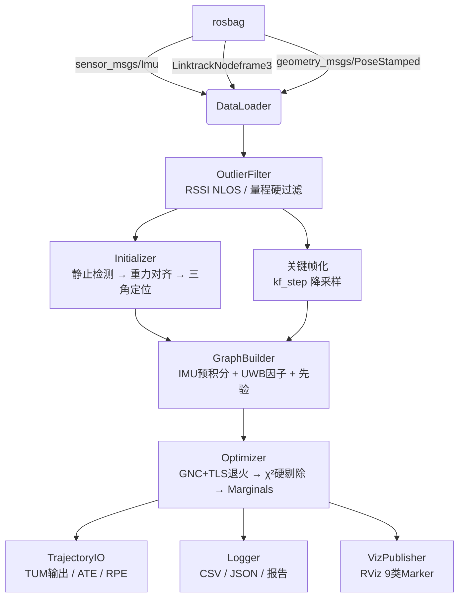
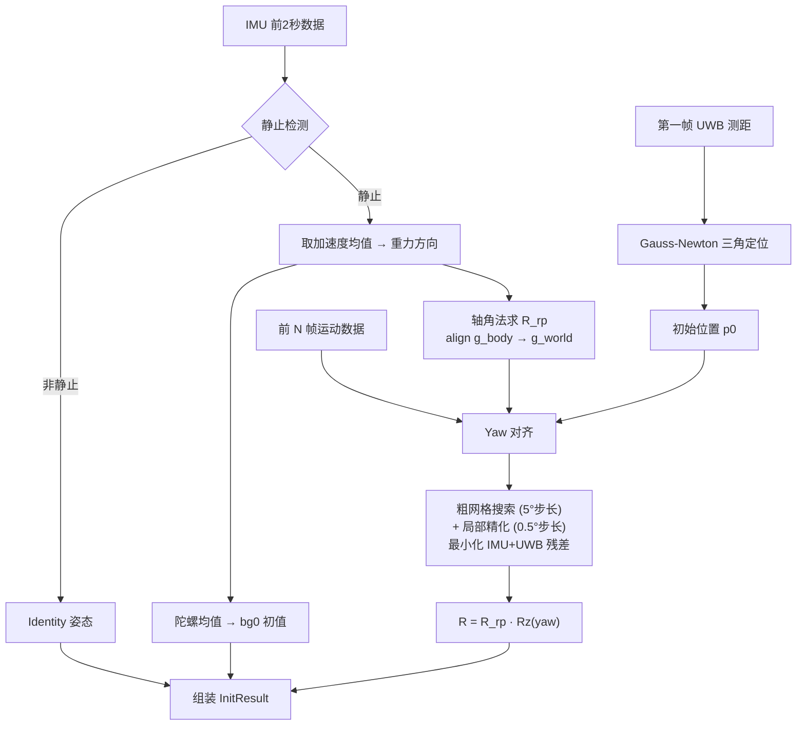
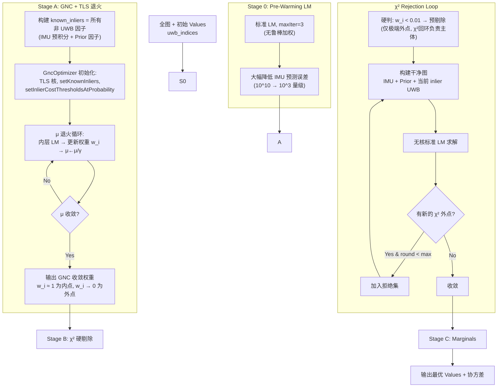

# UWB-IMU FGO 紧耦合融合定位系统 — 完整代码文档

> **项目名称**: `uwb_imu_fgo` (UWB-IMU Factor Graph Optimization)
> **定位**: 基于 GTSAM 的离线 batch 因子图优化 UWB-IMU 紧耦合定位系统，追求**最高后处理精度**
> **依赖**: ROS Noetic, GTSAM ≥ 4.2, Eigen3, yaml-cpp, Boost, GoogleTest

---

## 目录

1. [项目总览](#1-项目总览)
2. [数据流与数据读取](#2-数据流与数据读取)
3. [坐标系与符号约定](#3-坐标系与符号约定)
4. [状态变量定义](#4-状态变量定义)
5. [初始化流程](#5-初始化流程)
6. [IMU 预积分理论与实现](#6-imu-预积分理论与实现)
7. [UWB 因子理论](#7-uwb-因子理论)
8. [因子图构建](#8-因子图构建)
9. [多趟优化流程](#9-多趟优化流程)
10. [鲁棒外点剔除 Tricks](#10-鲁棒外点剔除-tricks)
11. [在线自标定](#11-在线自标定)
12. [噪声模型](#12-噪声模型)
13. [轨迹输出与精度评估](#13-轨迹输出与精度评估)
14. [可视化系统](#14-可视化系统)
15. [配置文件指南](#15-配置文件指南)
16. [理论公式汇总](#16-理论公式汇总)

---

## 1. 项目总览

### 1.1 设计目标

本系统面向**离线 batch 后处理**场景，核心诉求是**精度最高**，而非实时性。基于此，关键架构选型如下：

| 维度 | 选择 | 理由 |
|------|------|------|
| **优化框架** | GTSAM batch LM | 全量重线性化，精度优于增量 iSAM2 |
| **时间模型** | 离散关键帧 + IMU 预积分 | UWB 中低频，离散足够；无 LiDAR/相机去畸变需求 |
| **耦合方式** | 紧耦合 | 每锚点距离作为独立标量因子直接约束位姿 |
| **鲁棒策略** | GNC+TLS + $\chi^2$ 硬剔除 | GNC 退火识别 NLOS 粗差 → $\chi^2$ 硬剔除 |
| **精度核心** | 在线自标定 | 锚点位置、测距偏置、杆臂、时间偏移联合优化 |

### 1.2 架构组件一览



### 1.3 源文件索引

| 文件 | 职责 | 关键函数 |
|------|------|----------|
| `src/config.cpp` | YAML 配置解析 | `ConfigLoader::Load()` |
| `src/data_loader.cpp` | rosbag 读取 IMU/UWB/GT | `LoadFromBag()`, `LoadGroundTruth()` |
| `src/outlier_filter.cpp` | NLOS / 量程 / 一致性过滤 | `PreFilter()`, `ConsistencyCheck()` |
| `src/initializer.cpp` | 静止检测 + 重力对齐 + 三角定位 | `DetectStatic()`, `Trilaterate()`, `Run()` |
| `src/imu_preint.cpp` | IMU 预积分 + 线性插值 | `ImuPreintegrator`, `IntegrateBetween()` |
| `src/uwb_factor.cpp` | UWB Expression 因子 | `MakeUwbFactor()`, `BuildRange()` |
| `src/graph_builder.cpp` | 因子图组装 + 自适应协方差 | `Build()`, `AddUwbFactorsForFrame()`, `AdaptiveSigma()` |
| `src/optimizer.cpp` | GNC+TLS + χ² 剔除 + Marginals | `Optimize()`, `ChiSquareReject()`, `Covariance()` |
| `src/chi2.cpp` | χ² 逆 CDF 近似 | `Chi2inv()` |
| `src/trajectory_io.cpp` | TUM 输出 + ATE/RPE 评估 | `WriteTum()`, `ComputeATE()`, `ComputeRPE()` |
| `src/logger.cpp` | Debug 日志系统 | `LogStateTrace()`, `LogResiduals()`, `LogSummary()` |
| `src/visualizer.cpp` | RViz 可视化发布 | `PublishAll()` (9 类 marker) |
| `tools/run_offline.cpp` | 主入口 + 多趟流程编排 | `main()`, `RunPass()` |

---

## 2. 数据流与数据读取

### 2.1 数据源

所有数据从一个 **rosbag** 文件中读取，不依赖 ROS Master 实时通信。通过配置文件指定各 topic 名称。

**文件**: `src/data_loader.cpp` → `DataLoader::LoadFromBag()`

### 2.2 IMU 数据读取

```cpp
// Topic: config.imu_topic (默认 "/imu/data")
// 消息类型: sensor_msgs::Imu
```

**关键处理 — 加速度单位转换**:

许多 IMU 驱动（如 Livox）发布的 `linear_acceleration` 以 **g 为单位**（即 $1.0 = 1g$），而 GTSAM 预积分期望 **m/s²**。因此代码中做显式缩放：

```cpp
const double g_scale = cfg_.gravity;  // 通常 9.81
s.acc = Eigen::Vector3d(
    imu_msg->linear_acceleration.x * g_scale,
    imu_msg->linear_acceleration.y * g_scale,
    imu_msg->linear_acceleration.z * g_scale);
```

**诊断**: 读取完成后，代码检查前 200 个样本的加速度范数均值，若 $\ll 9.81$ 则输出警告。

陀螺仪数据直接使用原始值（rad/s），无需转换：
```cpp
s.gyro = Eigen::Vector3d(
    imu_msg->angular_velocity.x,
    imu_msg->angular_velocity.y,
    imu_msg->angular_velocity.z);
```

### 2.3 UWB 数据读取

```cpp
// Topic: config.uwb_topic (默认 "/nlink_linktrack_nodeframe3")
// 消息类型: uwb_imu_fgo::LinktrackNodeframe3 (自定义 ROS 消息)
```

**消息结构**（定义于 `msg/LinktrackNodeframe3.msg`）:
```
std_msgs/Header header
uint8 role, id
uint64 local_time, system_time
float32 voltage
LinktrackNode2[] nodes    # 测距数组
```

**每个 `LinktrackNode2`**:
```
uint8 id          # 锚点标识
float32 dis       # 测距值 (m)
float32 fp_rssi   # 首径 RSSI (dB)
float32 rx_rssi   # 总接收 RSSI (dB)
```

解析后存入 `UwbFrame` 结构（定义于 `include/uifgo/types.h`）：
```cpp
struct UwbFrame {
  double t;                    // rosbag 时间戳 (s)
  int    tag_id;
  std::vector<UwbRange> ranges;
};
```

### 2.4 VICON 地面真值读取

```cpp
// Topic: config.vicon_topic (空字符串 = 跳过)
// 消息类型: geometry_msgs::PoseStamped
```

若配置了 VICON topic，读取后转为 `NavState` 结构（注意速度、偏置置零 — 仅用于位置评估），存入 `gt_traj`。

### 2.5 时间排序

读取完成后，IMU 和 UWB 数据分别按时间升序排序，确保后续预积分和因子构建的时序正确性。

### 2.6 端到端数据流

```mermaid
flowchart LR
    subgraph Rosbag
        IMU_MSG[sensor_msgs/Imu]
        UWB_MSG[LinktrackNodeframe3]
        VICON_MSG[PoseStamped]
    end
    
    IMU_MSG -->|"* g_scale → m/s²"| IMU_SAMPLE[ImuSample<br/>t, acc, gyro]
    UWB_MSG -->|"解析 nodes[]"| UWB_FRAME[UwbFrame<br/>t, ranges]
    VICON_MSG -->|"Pose3 转换"| GT_TRAJ[NavState[]]
    
    IMU_SAMPLE --> SORT[按时间排序]
    UWB_FRAME --> SORT
    SORT --> FILTER[OutlierFilter]
    FILTER --> KF[关键帧降采样]
    KF --> GRAPH[因子图构建]
```

---

## 3. 坐标系与符号约定

### 3.1 三大坐标系

| 坐标系 | 符号 | 说明 |
|--------|------|------|
| **World 系 $W$** | — | 全局参考系，$z$ 轴竖直向上，重力沿 $-z$ 方向: $\mathbf{g}_W = (0, 0, -9.81)$ |
| **Body 系 $B$** | IMU 系 | 刚性连接于载体，IMU 原始数据在此坐标系下 |
| **UWB 天线点 $U$** | 标签天线 | UWB 标签天线相位中心，相对 $B$ 有杆臂 $\mathbf{t}_{UI}$ |

### 3.2 坐标变换

**位姿定义**: $\mathbf{T}_{WB} = (\mathbf{R}_{WB}, \mathbf{p}_{WB}) \in SE(3)$，表示从 Body 系到 World 系的变换。

UWB 天线在 World 系的位置：
$$\mathbf{p}_U^W = \mathbf{R}_{WB} \cdot \mathbf{t}_{UI} + \mathbf{p}_{WB}$$

其中 $\mathbf{t}_{UI}$ 是 **UWB 天线在 IMU 系下的坐标**（杆臂）。

### 3.3 李群扰动约定

- 旋转右乘更新: $\mathbf{R} \boxplus \boldsymbol{\theta} = \mathbf{R} \cdot \text{Exp}(\boldsymbol{\theta})$
- GTSAM `Pose3` 在 $\text{SO}(3) \times \mathbb{R}^3$ 上做 retraction
- 代码中不需要自己写 `LocalParameterization`（GTSAM Expression 自动处理）

### 3.4 GTSAM Symbol Key 命名

| Key | 类型 | 含义 |
|-----|------|------|
| `X(k)` | `Pose3` | 第 $k$ 关键帧位姿 $\mathbf{T}_k$ |
| `V(k)` | `Vector3` | 第 $k$ 关键帧速度 $\mathbf{v}_k$ |
| `B(k)` | `ConstantBias` | 第 $k$ 关键帧 IMU 偏置 $\mathbf{b}_k$ |
| `L(0)` | `Point3` | UWB-IMU 杆臂 $\mathbf{t}_{UI}$（全局共享，可选标定） |
| `A(m)` | `Point3` | 锚点 $m$ 的位置修正 $\delta\mathbf{A}_m$（可选标定） |
| `Z(m)` | `double` | 锚点 $m$ 的测距偏置 $\beta_m$（可选标定） |

---

## 4. 状态变量定义

### 4.1 每关键帧状态 (15维)

每个关键帧 $k$ 维护以下状态量：

$$\mathbf{x}_k = \begin{bmatrix} \mathbf{R}_k \\ \mathbf{p}_k \\ \mathbf{v}_k \\ \mathbf{b}_k^a \\ \mathbf{b}_k^g \end{bmatrix} \quad
\begin{aligned}
\mathbf{R}_k &\in \text{SO}(3) &\text{旋转矩阵 } \mathbf{R}_{WB} \\
\mathbf{p}_k &\in \mathbb{R}^3 &\text{位置 } \mathbf{p}_{WB} \\
\mathbf{v}_k &\in \mathbb{R}^3 &\text{世界系速度} \\
\mathbf{b}_k^a &\in \mathbb{R}^3 &\text{加速度计偏置} \\
\mathbf{b}_k^g &\in \mathbb{R}^3 &\text{陀螺仪偏置}
\end{aligned}$$

在 GTSAM 中表示为 `NavState(Pose3, Vector3)` + `imuBias::ConstantBias`。

**对应代码**: `include/uifgo/types.h` → `struct NavState`

### 4.2 全局标定变量

| 变量 | 维度 | 符号 | Key | 说明 |
|------|------|------|-----|------|
| 杆臂 | 3 | $\mathbf{t}_{UI}$ | `L(0)` | UWB 天线在 IMU 系中的位置 |
| 锚点修正 | $3N_a$ | $\delta\mathbf{A}_m$ | `A(m)` | 对每个锚点 $m$ 标称位置的修正 |
| 测距偏置 | $N_a$ | $\beta_m$ | `Z(m)` | 每锚点系统性测距偏置 |

标称锚点位置 + 修正 = 估计的锚点位置:
$$\mathbf{A}_m^{\text{est}} = \mathbf{A}_m^{\text{nom}} + \delta\mathbf{A}_m$$

---

## 5. 初始化流程

**文件**: `src/initializer.cpp` → `Initializer::Run()`

初始化分为四步（设计文档 §6）：



### 5.1 静止检测

```cpp
// src/initializer.cpp: DetectStatic()
```

取前 2 秒 IMU 数据，计算加速度范数方差：

$$\text{var}(||\mathbf{a}||) < 0.01 \;\; \land \;\; |\overline{||\mathbf{a}||} - g| < 1.0$$

两个条件同时满足判定为静止。阈值硬编码在 `initializer.cpp` 中。

### 5.2 重力对齐

核心思想：静止时加速度计测量的是 **支撑反力**（指向天空），因此 Body 系下的重力方向为：

$$\mathbf{g}_{\text{body}} = -\overline{\mathbf{a}} \cdot \frac{g}{||\overline{\mathbf{a}}||} \quad \text{(指向下方)}$$

World 系重力方向为 $\mathbf{g}_{\text{world}} = (0, 0, -g)$。

使用**轴角法**求旋转 $\mathbf{R}_{rp}$ 使 $\mathbf{g}_{\text{body}} \xrightarrow{\mathbf{R}_{rp}} \mathbf{g}_{\text{world}}$：

```cpp
Eigen::Vector3d axis = g_body.cross(g_world);
double cos_angle = g_body.dot(g_world) / (g_body.norm() * g_world.norm());
// ...
R_rp = gtsam::Rot3::AxisAngle(Unit3(axis), angle);
```

- 若两向量平行 ($\cos \theta > 0$): $\mathbf{R} = \mathbf{I}$
- 若反平行 ($\cos \theta < 0$): $\mathbf{R} = \text{Rx}(\pi)$（绕 X 轴翻转 180°）

**注意**: 此方法只能确定 roll 和 pitch，yaw 由下一步确定。

### 5.3 Yaw 对齐

```cpp
// src/initializer.cpp: AlignYaw()
```

**设计依据**: 设计文档 §6.3。yaw 不能由静止 IMU 确定，但 UWB 对世界系绝对朝向是可观的（有运动时）。

**算法**: 固定 roll/pitch（来自重力对齐）和 $\mathbf{p}_0$（来自三角定位），在前 `yaw_align_frames` 个关键帧上做 yaw 网格搜索：

1. **IMU 预积分**: 在相邻关键帧 $[k-1, k]$ 之间预积分 IMU 数据，得到相对运动 $\Delta\mathbf{R}_{k-1,k}$, $\Delta\mathbf{v}_{k-1,k}$, $\Delta\mathbf{p}_{k-1,k}$

2. **粗网格搜索**: 对 yaw $\theta \in [0, 2\pi)$ 以 5° 步长（72 个候选），每个候选：
   - 设 $\mathbf{R}_0 = \mathbf{R}_{rp} \cdot \mathbf{R}_z(\theta)$
   - 用 IMU 预积分 `predict()` 传播轨迹 $\mathbf{T}_k, \mathbf{v}_k$
   - 计算每个关键帧每个锚点的 UWB 测距残差 $r_{k,m} = \|\mathbf{A}_m - \mathbf{p}_U^W(\mathbf{T}_k)\| - z_{k,m}$
   - 累计 $\sum r_{k,m}^2$
   - 选择最小代价的 yaw

3. **局部精化**: 在粗搜索最优 yaw 的 ±5° 范围内以 0.5° 步长（21 个候选）精细搜索

**最终姿态**: $\mathbf{R}_{WB} = \mathbf{R}_{rp} \cdot \mathbf{R}_z(\theta_{\text{best}})$

**可配置项**: `keyframe.yaw_align_frames`（默认 15，设为 0 跳过 yaw 对齐）。

### 5.4 UWB 三角定位

```cpp
// src/initializer.cpp: Trilaterate()
```

用第一帧 UWB 测距 + 锚点标称位置，通过 **Gauss-Newton** 迭代求解初始位置：

目标函数：
$$\min_{\mathbf{p}} \sum_{i} \left( ||\mathbf{A}_i - \mathbf{p}|| - r_i \right)^2$$

Jacobian（第 $i$ 个锚点）：
$$\mathbf{J}_i = \frac{\partial}{\partial \mathbf{p}} (||\mathbf{A}_i - \mathbf{p}||) = -\frac{(\mathbf{A}_i - \mathbf{p})^T}{||\mathbf{A}_i - \mathbf{p}||} = \mathbf{u}_i^T$$

其中 $\mathbf{u}_i$ 是从锚点指向标签的单位向量。

Gauss-Newton 更新：
$$\mathbf{H} = \sum_i \mathbf{u}_i \mathbf{u}_i^T, \quad \mathbf{b} = -\sum_i \mathbf{u}_i \cdot (||\mathbf{A}_i - \mathbf{p}|| - r_i)$$

$$\Delta\mathbf{p} = \mathbf{H}^{-1} \mathbf{b}, \quad \mathbf{p} \leftarrow \mathbf{p} + \Delta\mathbf{p}$$

**要求**: 至少 3 个锚点（3D 定位需要 ≥ 4 个非共面锚点才能完全可观）。

初始猜测取所有锚点质心。

### 5.5 输出

`InitResult` 包含：
- `T0`: 初始位姿（重力对齐的 roll/pitch + yaw 对齐 + 三角定位的位置）
- `v0 = 0`: 初始速度为零
- `ba0 = 0`: 加速度计偏置初值为零
- `bg0`: 陀螺仪偏置初值（静止时陀螺均值）
- `gravity_world = (0, 0, -9.81)`

---

## 6. IMU 预积分理论与实现

**文件**: `src/imu_preint.cpp` → `ImuPreintegrator`

### 6.1 连续时间 IMU 模型

加速度计测量（Body 系）：
$$\tilde{\mathbf{a}}(t) = \mathbf{R}_{WB}^T(t) (\mathbf{a}_W(t) - \mathbf{g}_W) + \mathbf{b}^a(t) + \boldsymbol{\eta}^a$$

陀螺仪测量（Body 系）：
$$\tilde{\boldsymbol{\omega}}(t) = \boldsymbol{\omega}_{WB}^B(t) + \mathbf{b}^g(t) + \boldsymbol{\eta}^g$$

其中 $\boldsymbol{\eta}^a \sim \mathcal{N}(0, \sigma_a^2\mathbf{I})$, $\boldsymbol{\eta}^g \sim \mathcal{N}(0, \sigma_g^2\mathbf{I})$。

偏置建模为随机游走：
$$\dot{\mathbf{b}}^a = \boldsymbol{\eta}^{wa}, \quad \dot{\mathbf{b}}^g = \boldsymbol{\eta}^{wg}$$

其中 $\boldsymbol{\eta}^{wa} \sim \mathcal{N}(0, \sigma_{wa}^2\mathbf{I})$, $\boldsymbol{\eta}^{wg} \sim \mathcal{N}(0, \sigma_{wg}^2\mathbf{I})$。

### 6.2 预积分定义

两个关键帧 $k$ 和 $k+1$ 之间的预积分测量：

$$\Delta\mathbf{R}_{ij} = \prod_{t=i}^{j-1} \text{Exp}\left((\tilde{\boldsymbol{\omega}}_t - \mathbf{b}^g) \Delta t\right)$$

$$\Delta\mathbf{v}_{ij} = \sum_{t=i}^{j-1} \Delta\mathbf{R}_{it} (\tilde{\mathbf{a}}_t - \mathbf{b}^a) \Delta t$$

$$\Delta\mathbf{p}_{ij} = \sum_{t=i}^{j-1} \left[\Delta\mathbf{v}_{it} \Delta t + \frac{1}{2} \Delta\mathbf{R}_{it} (\tilde{\mathbf{a}}_t - \mathbf{b}^a) \Delta t^2\right]$$

### 6.3 GTSAM 实现

使用 GTSAM 的 `PreintegratedCombinedMeasurements`（中点预积分 + 协方差传播 + 偏置一阶修正）：

```cpp
// src/imu_preint.cpp: ImuPreintegrator 构造函数
auto p = PreintegratedCombinedMeasurements::Params::MakeSharedU(cfg.gravity);

// 加速度计噪声协方差
p->accelerometerCovariance = I * sigma_a^2;
// 陀螺仪噪声协方差
p->gyroscopeCovariance     = I * sigma_g^2;
// 偏置随机游走协方差
p->biasAccCovariance       = I * sigma_wa^2;
p->biasOmegaCovariance     = I * sigma_wg^2;
```

### 6.4 IMU 同步插值

```cpp
// src/imu_preint.cpp: IntegrateBetween()
```

由于 IMU 采样时刻和 UWB 关键帧时刻不同步，需要做**线性插值**：

```
关键帧 k-1        关键帧 k
    |----IMU样本1----IMU样本2----|
    t0                           t1
```

算法：
1. 跳过所有 $t \le t_0$ 的 IMU 样本
2. 对区间内每个 IMU 样本，以 `dt = t_curr - t_prev` 调用 `pim.integrateMeasurement()`
3. 在 $t_1$ 处，使用 `InterpolateImu()` 线性插值出一个"虚拟"样本完成最后一段

```cpp
// src/imu_preint.cpp: InterpolateImu()
double r = (t - s0.t) / (s1.t - s0.t);
out.acc  = s0.acc + r * (s1.acc - s0.acc);
out.gyro = s0.gyro + r * (s1.gyro - s0.gyro);
```

### 6.5 CombinedImuFactor

预积分完成后，`CombinedImuFactor` 连接两个关键帧状态：

$$\text{factor}(X(k-1), V(k-1), X(k), V(k), B(k-1), B(k))$$

残差包括 5 部分：旋转残差 (3D)、位置残差 (3D)、速度残差 (3D)、加速度计偏置残差 (3D)、陀螺仪偏置残差 (3D)，共 15 维。

GTSAM 的 `predict()` 方法可用于给下一帧提供初始线性化点。

---

## 7. UWB 因子理论

**文件**: `src/uwb_factor.cpp` → `MakeUwbFactor()`

### 7.1 测距残差模型

UWB 因子是一个**标量因子**（1D residual），表示预测距离与测量距离之差。

第 $k$ 帧对锚点 $m$ 的残差：

$$r_{k,m} = \underbrace{||(\mathbf{A}_m + \delta\mathbf{A}_m) - (\mathbf{R}_k \cdot \mathbf{t}_{UI} + \mathbf{p}_k)||}_{\text{预测几何距离}} + \underbrace{\beta_m}_{\text{测距偏置}} - \underbrace{z_{k,m}}_{\text{实测距离}}$$

其中：
- $\mathbf{A}_m$: 锚点 $m$ 标称位置（已知）
- $\delta\mathbf{A}_m$: 锚点位置修正（在线标定变量）
- $\mathbf{R}_k, \mathbf{p}_k$: 第 $k$ 帧 IMU 位姿
- $\mathbf{t}_{UI}$: UWB 天线在 IMU 系下的杆臂
- $\beta_m$: 锚点 $m$ 的测距偏置（在线标定变量）
- $z_{k,m}$: 实际 UWB 测距值

### 7.2 GTSAM Expression 实现

使用 GTSAM 的 **Expression** 框架自动求导，无需手写 Jacobian。

```cpp
// 天线在 World 系的位置
Pose3_  pose_(pose_key);
Point3_ lever_   = calib_lever ? Point3_(lever_key) : Point3_(lever_init);
Point3_ antenna_ = transformFrom(pose_, lever_);  // = R * t_UI + p

// 几何距离
Double_ rho = BuildRange(antenna_, anchor_nominal, calib_anchor, anchor_key);
// rho = ||antenna - (A_nom + dA)||

// 预测值（加入偏置）
Double_ predicted = calib_bias ? (rho + Double_(bias_key)) : rho;

// 构建 ExpressionFactor
auto noise = noiseModel::Isotropic::Sigma(1, sigma);
return make_shared<ExpressionFactor<double>>(noise, measured_range, predicted);
```

### 7.3 Jacobian 推导（供参考，代码使用自动微分）

对位姿 $\mathbf{p}_k$ 的 Jacobian：
$$\frac{\partial r}{\partial \mathbf{p}_k} = \frac{(\mathbf{p}_k + \mathbf{R}_k\mathbf{t}_{UI} - \mathbf{A}_m)^T}{d} = \mathbf{u}^T$$

其中 $d = ||\mathbf{p}_k + \mathbf{R}_k\mathbf{t}_{UI} - \mathbf{A}_m||$，$\mathbf{u}$ 是从锚点指向天线的单位向量。

对杆臂 $\mathbf{t}_{UI}$ 的 Jacobian：
$$\frac{\partial r}{\partial \mathbf{t}_{UI}} = \mathbf{u}^T \mathbf{R}_k$$

对锚点修正 $\delta\mathbf{A}_m$ 的 Jacobian：
$$\frac{\partial r}{\partial \delta\mathbf{A}_m} = -\mathbf{u}^T$$

对测距偏置 $\beta_m$:
$$\frac{\partial r}{\partial \beta_m} = 1$$

### 7.4 标定开关的 Expression 技巧

当某个标定变量关闭时，使用**常量 Expression 叶子节点**（而非变量 Key），GTSAM 自动不收集对应的变量 Key：

```cpp
// 杆臂不开标定 → 使用常量 Point3
Point3_ lever_ = calib_lever ? Point3_(lever_key) : Point3_(lever_init);

// 锚点不开标定 → 使用常量 anchor_nominal
// (在 BuildRange 中通过函数重载实现)
```

---

## 8. 因子图构建

**文件**: `src/graph_builder.cpp` → `GraphBuilder::Build()`

### 8.1 关键帧策略

- 对 UWB 帧按 `kf_step` 降采样（如 `step=5` 则每 5 帧取 1 帧）
- 默认 `kf_step=1` 即所有 UWB 帧都是关键帧
- 每个关键帧的时刻就是 UWB 帧的时间戳

### 8.2 因子图结构

```
  X(0)  --IMU-->  X(1)  --IMU-->  X(2)  --IMU--> ... --IMU--> X(N-1)
   |               |               |
   | UWB factors   | UWB factors   | UWB factors
   v               v               v
  anchors         anchors         anchors
  
   + 先验: X(0), V(0), B(0) 有强先验 (固定初始帧)
   + 标定变量先验: L(0), A(m), Z(m) 有宽松先验
```

### 8.3 构建步骤

**Step 1 — 第一帧先验**:

```cpp
// 强先验固定初始帧（位姿 ±1cm, 速度 ±0.1m/s, 偏置 ±0.01）
auto posePriorNoise = noiseModel::Diagonal::Sigmas(
    (Vector(6) << 0.01,0.01,0.01, 0.05,0.05,0.05).finished());
auto velPriorNoise  = noiseModel::Isotropic::Sigma(3, 0.1);
auto biasPriorNoise = noiseModel::Isotropic::Sigma(6, 0.01);

graph->addPrior(X(0), init.T0, posePriorNoise);
graph->addPrior(V(0), init.v0, velPriorNoise);
graph->addPrior(B(0), bias0, biasPriorNoise);
```

**Step 2 — 标定变量先验**:

```cpp
// 杆臂先验: N(t_init, lever_prior_sigma^2)
// 锚点修正: N(0, anchor_prior_sigma^2)  — 零均值 → 信任标称位置
// 测距偏置: N(0, range_bias_sigma^2)    — 零均值 → 信任无偏测距
```

**Step 3 — 循环构建 IMU + UWB 因子**:

对每个关键帧 $k = 1, \dots, N-1$:

1. **IMU 预积分**: 在两帧之间积分 IMU 测量
   ```cpp
   pim.Reset(prev_bias);
   IntegrateBetween(imu, i_imu, t_{k-1}, t_k, &pim);
   graph->add(CombinedImuFactor(X(k-1), V(k-1), X(k), V(k), B(k-1), B(k), pim.Pim()));
   ```

2. **预测初值**: 使用预积分 `predict()` 为下一帧提供线性化点
   ```cpp
   NavState pred = pim.Pim().predict(NavState(prev_pose, prev_vel), prev_bias);
   values->insert(X(k), pred.pose());
   values->insert(V(k), pred.velocity());
   values->insert(B(k), prev_bias);  // 偏置暂不变
   ```

3. **UWB 因子**: 为该帧的每个有效测距添加
   ```cpp
   AddUwbFactorsForFrame(k, uwb_kf[k], graph, uwb_indices, values, false);
   ```

### 8.4 自适应测距协方差

```cpp
// src/graph_builder.cpp: AdaptiveSigma()
double AdaptiveSigma(double dt_since_last) const {
  double extra = (dt_since_last > 0) ? (cfg_.v_max * dt_since_last / 3.0) : 0.0;
  return std::sqrt(cfg_.sigma_range * cfg_.sigma_range + extra * extra);
}
```

建模逻辑：UWB 帧间隔时间越长，载体可能移动越远，测距的不确定性越大。

$$\sigma_{\text{range}}^2 = \sigma_r^2 + \left(\frac{v_{\max} \cdot \Delta t}{3}\right)^2$$

其中 $v_{\max}$ 是载体最大速度的估计（约 3 m/s），$\Delta t$ 是该锚点距离上一次被观测的间隔。

---

## 9. 多趟优化流程

**文件**: `tools/run_offline.cpp` (主编排) + `src/optimizer.cpp` (单趟优化)

### 9.1 整体策略

采用**GNC 鲁棒初始化 + 渐进式标定 + 多趟精修**（设计文档 §6.3）：

```
Pass 1: GNC+TLS Robust Init (所有标定 OFF)
        → setKnownInliers 把 IMU/先验钉为已知内点
        → GNC 自动为每个 UWB 因子赋权 w ∈ [0,1]
        → w < gnc_weight_thresh 的 UWB 因子判为外点
   ↓
Pass 2: Open Range Bias (仅开测距偏置, 纯内点 LM)
   ↓  (如果 chi2 不退化)
Pass 3: Open Anchor Calib (开锚点修正)
   ↓  (如果 chi2 不退化)  
Pass 4: Open Lever Arm (开杆臂标定)
   ↓  (如果 chi2 不退化)
Pass Final: All Joint (全部标定联合精修, χ² 监控)
```

**退火保护**: 每趟优化后检查 `reduced_chi2`，若退化超过 1.5×/2.0× 则退回到上一趟结果。

```cpp
if (res.reduced_chi2 < res1.reduced_chi2 * 1.5) {
  best_values = res.values;  // 接受
} else {
  // 拒绝，保留上一趟
}
```

### 9.2 单趟优化内部流程（四阶段流水线）

**文件**: `src/optimizer.cpp` → `Optimizer::Optimize()`



### 9.3 Stage 0 — Pre-Warming LM

**设计必要性**: 初始 IMU 预测轨迹（零偏置初始化）可产生 $10^9\sim 10^{11}$ 量级的初始代价。若 GNC+TLS + `setKnownInliers` 直接在此初始值上运行，IMU 主导的误差将迫使所有 UWB 权重趋近于零，导致灾难性外点剔除（93%+ UWB 因子丢失）。

**实现**: 在 GNC 之前先运行 3 次标准 LM 迭代（无鲁棒加权，所有因子等权），将代价降低数个数量级（$10^{10}\to 10^3$），使 GNC 能在合理的解上正确区分 NLOS 外点与内点。

```cpp
LevenbergMarquardtParams prewarm_params = lm_params;
prewarm_params.setMaxIterations(3);
Values prewarmed = initial;
{
  LevenbergMarquardtOptimizer preopt(graph, prewarmed, prewarm_params);
  prewarmed = preopt.optimize();
}
// prewarmed 作为 GNC 的初始值, 而非原始 initial
```

### 9.4 Stage A — GNC+TLS 鲁棒退火

**设计依据**: 设计文档 §15.1。UWB 在 NLOS 下产生**正偏置粗差**（距离偏大），必须在保留所有可信约束（IMU 预积分、先验）的前提下，只对 UWB 因子做鲁棒处理。

**GNC (Graduated Non-Convexity)** 引入控制参数 $\mu$，将代价从凸（$\mu$ 大，近似全内点 $\ell_2$）逐步同伦到真实非凸 TLS：

$$\hat{x},\,\hat{w} = \arg\min_{x,\,w\in[0,1]^M}\; \sum_i w_i\,\|e_i(x)\|^2_{\Sigma_i} + \Phi_\mu(w_i)$$

收敛时内点 $w_i\to 1$、外点 $w_i\to 0$。

**核心设计 — setKnownInliers**: 把 IMU 预积分因子与所有先验因子的权重**钉死为 1**，GNC 的鲁棒"预算"全部用于甄别 UWB 粗差，既防止误删可信的惯性约束，又显著提升收敛稳定性。

**实现**: 使用 `gtsam::GncOptimizer<GncParams<LevenbergMarquardtParams>>`，TLS 核。

```cpp
// 构建 known-inliers: 所有非 UWB 因子
GncParams<LevenbergMarquardtParams>::IndexVector known_inliers;
for (size_t i = 0; i < graph.size(); ++i)
  if (!uwb_set.count(i)) known_inliers.push_back(i);

GncParams<LevenbergMarquardtParams> gncParams(lm_params);
gncParams.setLossType(GncLossType::TLS);
gncParams.setKnownInliers(known_inliers);
gncParams.setMuStep(cfg_.gnc_mu_step);       // μ 同伦步长 (默认 1.4)
gncParams.setMaxIterations(cfg_.gnc_max_iter);  // 外循环最大迭代 (默认 50)
// 用卡方分位数自动设置每个因子的内点代价阈值
//   barc² = 0.5 * χ²inv(gnc_inlier_prob, dim)
gncParams.setInlierCostThresholdsAtProbability(cfg_.gnc_inlier_prob);

GncOptimizer<LevenbergMarquardtParams> gnc(graph, initial, gncParams);
Values gnc_result = gnc.optimize();
out.gnc_weights   = gnc.getWeights();  // size = graph.size()
```

**退火过程**:

| 阶段 | $\mu$ 值 | 效果 |
|------|---------|------|
| 初始 | $\mu$ 大（凸） | 近 $\ell_2$，所有 UWB 权重 $\approx 1$ |
| 中间 | $\mu$ 递减 | 非凸性增加，NLOS 外点权重被压低 |
| 收敛 | $\mu \to \mu_{\min}$ | $w_i \approx 1$（内点），$w_i \to 0$（外点） |

**硬判**: GNC 收敛后，仅 $w_i <$ `gnc_weight_thresh`（默认 **0.01**，保守值）的极端外点被预剔除。主要的 NLOS 外点剔除由后续 $\chi^2$ 回环（Stage B）负责。这避免了 GNC 在初始误差较大时将过多有效 UWB 约束误判为外点。

**GNC + χ² 双保险设计**: GNC 的 TLS 权重提供软降权（优化时减少外点影响），χ² 回环提供硬剔除（统计检验确定外点）；GNC 权重预剔除仅作为可选的极端外点加速手段（默认阈值 0.01，极其保守）。

### 9.5 Stage B — $\chi^2$ 硬剔除

**设计依据**: GNC 的 TLS 已能压低粗差，但其软权重不做硬剔除。$\chi^2$ 回环负责把 $w_i$ 介于灰区（$\approx 0.3\sim 0.7$）、GNC 未彻底拒绝的边缘外点清掉，并在**无核 clean 图**上复算残差，避免鲁棒权重掩盖真实超限。

GTSAM 的 `factor->error(x)` 返回 $\frac12\|e_i\|^2_{\Sigma_i}$，故白化残差平方为：
$$\chi^2_i = 2 \cdot \texttt{error}_i = \|e_i(x)\|^2_{\Sigma_i}$$

在零假设（测量正确、噪声高斯）下，$\chi^2_i \sim \chi^2(d_i)$。对 UWB 因子 $d_i=1$：

```cpp
// src/optimizer.cpp: ChiSquareReject()
for each UWB factor i:
    chi2_i = 2 * factor->error(values)     // = ||r/sigma||²
    threshold = Chi2inv(0.99, factor->dim())  // 99% confidence, dof=1
    if chi2_i > threshold:
        reject factor i
```

$\chi^2$ 逆 CDF 通过查表 + Wilson-Hilferty 近似实现（`src/chi2.cpp`）：

| dof | p=0.95 | p=0.99 |
|-----|--------|--------|
| 1 | 3.8415 | 6.6349 |
| 2 | 5.9915 | 9.2103 |
| 3 | 7.8147 | 11.3449 |
| 4 | 9.4877 | 13.2767 |
| 5 | 11.0705 | 15.0863 |
| 6 | 12.5916 | 16.8119 |

对于 $dof > 6$，使用 Wilson-Hilferty 近似：
$$\chi^2_{\alpha}(d) \approx d \left(1 - \frac{2}{9d} + z_{\alpha} \sqrt{\frac{2}{9d}}\right)^3$$

其中 $z_{0.95} = 1.6449$, $z_{0.99} = 2.3263$。

**回环收敛性**: 每轮只**新增**外点、从不复活，集合单调增长，至多 `max_rejection_rounds` 轮必停；实践中 1∼2 轮即收敛。

### 9.6 Stage C — Marginals (协方差)

**关键**: GNC 收敛后的图带有鲁棒权重 $w_i$，其线性化信息矩阵 $\sum_i w_i J_i^\top\Sigma_i^{-1}J_i$ 被人为压低，直接取 `Marginals` 会得到失真（偏乐观或不一致）的协方差。因此必须在剔除外点后的**纯内点、无鲁棒核**图上计算协方差：

```cpp
Marginals marg(clean_graph_, result_values_, Marginals::CHOLESKY);
return marg.marginalCovariance(key);
```

其中 `clean_graph_` 仅含 IMU 预积分因子、先验因子、以及通过 GNC + $\chi^2$ 双重检验的 inlier UWB 因子。

### 9.7 诊断：约化卡方解读

全局拟合优度用约化卡方评估：
$$\chi^2_\nu = \frac{2 \cdot E(\hat{x})}{\nu}, \quad \nu = \sum_i d_i - \dim(x)$$

| $\chi^2_\nu$ 区间 | 含义 | 处置 |
|------|------|------|
| $\approx 1$ ($0.8\sim 1.2$) | 噪声模型与数据一致 | 正常，直接采纳协方差 |
| $\gg 1$ | $\sigma$ 设小 / 未建模误差 / 残留外点 | 检查 $\sigma_{\text{range}}$、时间自适应项、收紧卡方剔除 |
| $\ll 1$ ($<0.5$) | $\sigma$ 设大（过保守） | 协方差偏大，可适当调小 $\sigma$ 重跑 |

---

## 10. 鲁棒外点剔除 Tricks

系统在**三个层次**上实施外点剔除：

### 10.1 前置物理过滤 (Pre-filter)

**文件**: `src/outlier_filter.cpp` → `OutlierFilter::PreFilter()`

```cpp
// Trick 1: RSSI 差值 NLOS 检测
if (r.rx_rssi - r.fp_rssi > cfg_.nlos_rssi_diff)  // 默认 6.0 dB
    continue;  // 丢弃 — 多径效应显著

// Trick 2: 量程硬截断
if (r.dist < cfg_.min_range || r.dist > cfg_.max_range)  // 默认 [0.3, 100.0]m
    continue;  // 丢弃 — 超出传感器物理能力
```

**RSSI 差值原理**: 在 LOS (视距) 条件下，首径信号功率接近总接收功率；在 NLOS (非视距) 条件下，信号经多次反射到达，`rx_rssi` 显著大于 `fp_rssi`。差值越大，NLOS 概率越高。

### 10.2 距离一致性检查 (Consistency Check)

```cpp
// src/outlier_filter.cpp: ConsistencyCheck()
double predicted = ||tag_pred_world - anchor_pos||;
return |predicted - range.dist| <= dist_consistency_thresh;  // 默认 1.0m
```

在有预测位置时，检查测量距离是否与预测距离一致。带有 **warm-up** 机制：前 `warmup_frames` (默认 20) 帧不做此检查。

### 10.3 $\chi^2$ 统计检验 (Stage B)

如 §9.5 所述，基于白化残差的 $\chi^2$ 分布检验做硬剔除。置信度默认 0.99（宽松），最多 3 轮迭代。

### 10.4 GNC+TLS 软加权 (Stage A)

如 §9.4 所述，在 $\chi^2$ 硬剔除前先用 GNC TLS 退火做软加权：$\mu$ 从大（凸、近 $\ell_2$）逐步退火到真实非凸 TLS，自动为每个 UWB 因子赋权 $w_i\in[0,1]$，外点权重被压向 0。IMU 预积分和先验因子通过 `setKnownInliers` 钉为已知内点，不参与 GNC 加权。

---

## 11. 在线自标定

### 11.1 标定变量总览

| 变量 | 符号 | 维度 | GTSAM Key | 先验 |
|------|------|------|-----------|------|
| 杆臂 | $\mathbf{t}_{UI}$ | 3 | `L(0)` | $\mathcal{N}(\mathbf{t}_{\text{init}}, \sigma_L^2)$ |
| 锚点修正 | $\delta\mathbf{A}_m$ | 3 | `A(m)` | $\mathcal{N}(\mathbf{0}, \sigma_A^2)$ |
| 测距偏置 | $\beta_m$ | 1 | `Z(m)` | $\mathcal{N}(0, \sigma_\beta^2)$ |
| 时间偏移 | $t_d$ | 1 | (预留) | $\mathcal{N}(t_{d,\text{init}}, \sigma_{td}^2)$ |

### 11.2 渐进式标定策略

不在一开始就打开所有标定变量，因为：

1. **杆臂与位置耦合强**: 在轨迹初值不准确时，杆臂标定可能吸收位置误差
2. **锚点修正需要足够观测**: 需要在多帧、多视角下观测到同一锚点
3. **偏置与锚点修正可能冲突**: 测距偏差可能被锚点位置修正吸收

因此采用渐进式：
- **Pass 1**: 全关 → 用标称值获得可靠的初始轨迹
- **Pass 2**: 开偏置 → 在已有轨迹基础上标定 $\beta_m$
- **Pass 3**: 开锚点 → 标定 $\delta\mathbf{A}_m$
- **Pass 4**: 开杆臂 → 标定 $\mathbf{t}_{UI}$
- **Pass Final**: 全开联合精修

### 11.3 标定退化检测

每趟之后检查 $\chi^2/\text{dof}$：若比 Pass 1 的基准值退化超过 1.5×（或 Pass Final 超过 2.0×），回退到上一趟结果。

---

## 12. 噪声模型

### 12.1 IMU 噪声

| 参数 | 符号 | 默认值 | 物理含义 |
|------|------|--------|----------|
| `sigma_a` | $\sigma_a$ | 0.1 | 加速度计白噪声 (m/s²) |
| `sigma_g` | $\sigma_g$ | 0.01 | 陀螺仪白噪声 (rad/s) |
| `sigma_wa` | $\sigma_{wa}$ | 0.01 | 加速度计随机游走 (m/s³) |
| `sigma_wg` | $\sigma_{wg}$ | 2.0e-5 | 陀螺仪随机游走 (rad/s²) |

GTSAM 预积分中使用**对角协方差**：
```cpp
p->accelerometerCovariance = I * sigma_a^2;
p->gyroscopeCovariance     = I * sigma_g^2;
p->biasAccCovariance       = I * sigma_wa^2;
p->biasOmegaCovariance     = I * sigma_wg^2;
```

### 12.2 UWB 测距噪声 — 时间自适应

基础测距噪声 $\sigma_r = 0.10 \sim 0.15$ m。

时间自适应扩展（§8.4）：
$$\sigma_{\text{eff}}^2 = \sigma_r^2 + \left(\frac{v_{\max} \cdot \Delta t}{3}\right)^2$$

**设计思想**: UWB 帧间隔越大，载体在间隔内可能移动越远，等效于更大的测距不确定度。$1/3$ 因子来自均匀分布的标准差近似（假设载体在 $\Delta t$ 内匀速运动，位置不确定性 $\sim v_{\max}\Delta t$ 的 $1/\sqrt{12} \approx 1/3.46$）。

### 12.3 先验噪声

| 先验 | 噪声设置 | 含义 |
|------|----------|------|
| 初始位姿 | $\sigma_{xyz} = 0.01$m, $\sigma_{rpy} = 0.05$rad | 强先验，固定第一帧 |
| 初始速度 | $\sigma_v = 0.1$ m/s | 中强先验 |
| 初始偏置 | $\sigma_b = 0.01$ | 强先验 |
| 杆臂 | $\sigma_L = 0.05$m | 宽松先验，允许较大修正 |
| 锚点修正 | $\sigma_A = 0.08 \sim 0.10$m | 宽松先验 |
| 测距偏置 | $\sigma_\beta = 0.05$m | 中等先验 |

---

## 13. 轨迹输出与精度评估

**文件**: `src/trajectory_io.cpp`

### 13.1 TUM 格式输出

```
timestamp tx ty tz qx qy qz qw
```

- `timestamp`: 秒（浮点，9 位小数）
- `tx, ty, tz`: 位置 (m)
- `qx, qy, qz, qw`: 四元数旋转 (x, y, z, w)

### 13.2 ATE — 绝对轨迹误差

**文件**: `src/trajectory_io.cpp` → `ComputeATE()`

对每个估计帧，在 GT 中找最近时间戳的帧（简单最近邻，非 Umeyama 对齐）：

$$\text{ATE}_{\text{RMSE}} = \sqrt{\frac{1}{N} \sum_{i=1}^{N} ||\mathbf{p}_i^{\text{est}} - \mathbf{p}_i^{\text{gt}}||^2}$$

### 13.3 RPE — 相对位姿误差

**文件**: `src/trajectory_io.cpp` → `ComputeRPE()`

对固定段长（默认为 1s）的位移误差：

$$\text{RPE}_{\text{RMSE}} = \sqrt{\frac{1}{M} \sum_{i} ||(\mathbf{p}_{i+\Delta}^{\text{est}} - \mathbf{p}_i^{\text{est}}) - (\mathbf{p}_{i+\Delta}^{\text{gt}} - \mathbf{p}_i^{\text{gt}})||^2}$$

### 13.4 百分位统计

```cpp
// tools/run_offline.cpp 中
std::sort(pos_errors.begin(), pos_errors.end());
p50 = pos_errors[pos_errors.size() * 50 / 100];
p95 = pos_errors[pos_errors.size() * 95 / 100];
p99 = pos_errors[pos_errors.size() * 99 / 100];
max_err = pos_errors.back();
```

提供 P50 / P95 / P99 / Max 四个统计量，全面评估误差分布。

### 13.5 标定报告

**文件**: `src/trajectory_io.cpp` → `WriteCalib()`

输出格式 (`calibration.txt`):
```
# Lever arm (UWB antenna in IMU frame)
lever_arm: [x, y, z]

# Anchor position corrections
anchor_1: nom=[x,y,z] corr=[dx,dy,dz] est=[x+dx, y+dy, z+dz]
...

# Range biases
bias_1: beta m
...
```

---

## 14. 可视化系统

**文件**: `src/visualizer.cpp` → `VizPublisher`

### 14.1 9 类 RViz Marker

| # | Marker 类型 | 发布 Topic | 说明 |
|---|------------|-----------|------|
| 1 | 绿色球体 + 文本 | `anchor_initial` | 锚点标称位置 |
| 2 | 橙色球体 + 位移箭头 | `anchor_optimized` | 锚点标定后位置 |
| 3 | 蓝色 Path | `gt_trajectory` | VICON 地面真值轨迹 |
| 4 | 红色 Path | `fused_trajectory` | 融合估计轨迹 |
| 5 | RGB 箭头 | `keyframe_poses` | 关键帧姿态坐标系 (R=前, G=左, B=上) |
| 6 | 青色线段 | `uwb_edges` | UWB 测距连线 (tag → anchor) |
| 7 | 半透明椭球 | `covariance_ellipsoids` | 2σ 协方差椭球 |
| 8 | 彩色箭头 | `error_vectors` | 估计→GT 误差向量 (绿→红按误差大小) |
| 9 | 文本面板 | `metrics_text` | ATE / P95 / 耗时 / 关键帧数 |

所有 Marker 以 **latched** 方式发布，RViz 后启动也能接收。

### 14.2 TF 广播

```cpp
// 持续广播 world→map 的 identity TF
tf_broadcaster_.sendTransform(
    StampedTransform(tf_id, ros::Time::now(), "world", "map"));
```

RViz 需要有效的 TF 树才能渲染 Fixed Frame 中的 Marker。

### 14.3 降采样

为防止 RViz 渲染过载，可视化时按 `viz_step = max(1, traj.size() / 300)` 降采样，目标每类 Marker 不超过约 300 个元素。

---

## 15. 配置文件指南

### 15.1 完整配置项 (`config/slam.yaml`)

```yaml
# ============= 锚点配置 =============
anchors:
  - {id: 1, pos: [x, y, z], prior_sigma: 0.10}  # 标称位置 + 修正先验 std

# ============= 外参 =============
extrinsics:
  lever_arm_init: [0.0, 0.0, 0.0]   # UWB天线在IMU系初始位置
  calib_lever: false                 # 是否在线标定杆臂
  lever_prior_sigma: 0.05            # 杆臂先验标准差

# ============= 在线标定开关 =============
calibration:
  calib_anchor: false                # 在线修正锚点位置
  calib_range_bias: false            # 在线标定测距偏置
  range_bias_sigma: 0.05             # 偏置先验标准差
  calib_td: false                    # 在线标定时间偏移 (预留)
  td_init: 0.0                       # 时间偏移初值

# ============= IMU 噪声 =============
imu:
  sigma_a: 0.1                       # 加速度计白噪声 (m/s²)
  sigma_g: 0.01                      # 陀螺仪白噪声 (rad/s)
  sigma_wa: 0.001                    # 加速度计随机游走 (m/s³)
  sigma_wg: 2.0e-5                   # 陀螺仪随机游走 (rad/s²)
  gravity: 9.81                      # 重力大小

# ============= UWB 噪声 & 过滤 =============
uwb:
  sigma_range: 0.15                  # 基础测距标准差 (m)
  v_max: 3.0                         # 最大速度用于自适应协方差
  nlos_rssi_diff: 6.0                # NLOS RSSI 差值阈值 (dB)
  min_range: 0.3                     # 最小有效距离 (m)
  max_range: 100.0                   # 最大有效距离 (m)
  dist_consistency_thresh: 2.0       # 距离一致性阈值 (m)
  warmup_frames: 20                  # 预热帧数

# ============= 求解器 (含 GNC 鲁棒优化) =============
solver:
  lm_max_iter: 200                   # LM 最大迭代次数 (GNC 内层 & clean 精修共用)
  rel_error_tol: 1.0e-6              # 相对误差收敛阈值
  abs_error_tol: 1.0e-8              # 绝对误差收敛阈值
  # --- GNC (Graduated Non-Convexity) TLS 退火 ---
  gnc_mu_step: 1.4                   # μ 同伦步长
  gnc_max_iter: 50                   # GNC 外循环最大迭代
  gnc_rel_cost_tol: 1.0e-5           # GNC 相对代价收敛阈值
  gnc_inlier_prob: 0.99              # 内点代价阈值的卡方置信度
  gnc_weight_thresh: 0.01            # GNC 权重硬判内/外点门限 (保守: w<0.01 才预剔除，χ² 回环负责主要剔除)
  # --- 卡方剔除回环 (post-GNC) ---
  chi2_reject_prob: 0.99             # 逐因子卡方剔除置信度 (0.99 = 宽松, 0.95 = 严格)
  max_rejection_rounds: 3            # 卡方剔除回环最大轮次

# ============= 关键帧 =============
keyframe:
  step: 5                            # 降采样步长 (1=全部)
  yaw_align_frames: 15               # yaw 对齐使用的关键帧数 (0=禁用)

# ============= Debug =============
debug:
  log: true                          # 是否输出 debug log

# ============= ROS Topics =============
topics:
  imu: "/livox/imu"
  uwb: "/nlink_linktrack_nodeframe3"
  vicon: ""                          # 留空=不使用GT

# ============= Rosbag =============
bag:
  path: "../data/xxx.bag"            # 相对config目录或绝对路径
  start: 0.0                         # 起始偏移 (s)
  durr: -1.0                         # 时长 (-1=全部)
```

### 15.2 bag path 解析逻辑

```cpp
// src/config.cpp: ConfigLoader::ResolveBagPath()
// 尝试顺序:
// 1. 按原路径直接查找
// 2. 相对 config_dir 查找
// 3. 相对项目 data/ 目录查找 (pkg_root/data/ + basename)
```

---

## 16. 理论公式汇总

### 16.1 优化目标函数

$$\min_{\mathbf{X}} \underbrace{\sum_{k=1}^{N-1} \|\mathbf{r}_{\text{IMU},k}\|^2_{\Sigma_{\text{IMU}}}}_{\text{IMU 因子}} + \underbrace{\sum_{k=0}^{N-1}\sum_{m} \rho\left(\frac{r_{\text{UWB},k,m}}{\sigma_{k,m}}\right)}_{\text{UWB 因子 (鲁棒核)}} + \underbrace{\|\mathbf{r}_{\text{prior}}\|^2_{\Sigma_{\text{prior}}}}_{\text{先验因子}}$$

其中 $\rho(\cdot)$ 为鲁棒核函数，$\mathbf{r}_{\text{IMU},k}$ 是 15D 预积分残差。

### 16.2 IMU 预积分残差

$$\mathbf{r}_{\Delta\mathbf{R}} = \text{Log}\left(\Delta\tilde{\mathbf{R}}_{ij}^T \mathbf{R}_i^T \mathbf{R}_j\right)$$

$$\mathbf{r}_{\Delta\mathbf{v}} = \mathbf{R}_i^T(\mathbf{v}_j - \mathbf{v}_i - \mathbf{g}\Delta t_{ij}) - \Delta\tilde{\mathbf{v}}_{ij}$$

$$\mathbf{r}_{\Delta\mathbf{p}} = \mathbf{R}_i^T\left(\mathbf{p}_j - \mathbf{p}_i - \mathbf{v}_i\Delta t_{ij} - \frac{1}{2}\mathbf{g}\Delta t_{ij}^2\right) - \Delta\tilde{\mathbf{p}}_{ij}$$

偏置残差：
$$\mathbf{r}_{\mathbf{b}} = \begin{bmatrix} \mathbf{b}_j^a - \mathbf{b}_i^a \\ \mathbf{b}_j^g - \mathbf{b}_i^g \end{bmatrix}$$

### 16.3 UWB 测距残差

$$r_{k,m} = \left\|(\mathbf{A}_m + \delta\mathbf{A}_m) - \left(\mathbf{R}_k \mathbf{t}_{UI} + \mathbf{p}_k\right)\right\| + \beta_m - z_{k,m}$$

### 16.4 自适应测距协方差

$$\sigma_{k,m}^2 = \sigma_r^2 + \left(\frac{v_{\max} \cdot \Delta t_{k,m}}{3}\right)^2$$

### 16.5 GNC TLS 权重

GNC 优化目标（TLS 核）：
$$\hat{x},\,\hat{w} = \arg\min_{x,\,w\in[0,1]^M}\; \sum_i w_i\,\|e_i(x)\|^2_{\Sigma_i} + \Phi_\mu(w_i)$$

收敛时内点 $w_i\to 1$、外点 $w_i\to 0$。IMU 预积分与先验因子通过 `setKnownInliers` 钉为 $w_i\equiv 1$，GNC 的鲁棒"预算"全部用于甄别 UWB 粗差。

内点代价阈值由卡方分位数自动给出：$\bar{c}^2 = \frac12\chi^2_{1-\alpha}(d)$（GTSAM 代价含 $\frac12$ 因子）。

硬判: GNC 收敛后仅 $w_i <$ `gnc_weight_thresh`（默认 **0.01**）的极端外点被预剔除；$\chi^2$ 检验（§16.6）是主要的外点剔除手段。

### 16.6 $\chi^2$ 外点检验

$$\text{若 } \frac{\|\mathbf{r}_i\|^2}{\sigma_i^2} > \chi^2_{\alpha}(d_i), \text{ 则标记为外点}$$

对 UWB 因子，$d_i = 1$，$\alpha = 0.99$（默认）。

### 16.7 Gauss-Newton 三角定位

$$\mathbf{H} = \sum_i \mathbf{u}_i \mathbf{u}_i^T, \quad \mathbf{b} = -\sum_i \mathbf{u}_i (d_i - z_i)$$

$$\mathbf{u}_i = \frac{\mathbf{A}_i - \mathbf{p}}{\|\mathbf{A}_i - \mathbf{p}\|}, \quad \mathbf{p} \leftarrow \mathbf{p} + \mathbf{H}^{-1}\mathbf{b}$$

### 16.8 重力对齐（轴角法）

$$\mathbf{g}_{\text{body}} = -\bar{\mathbf{a}}_{\text{static}}, \quad \mathbf{g}_{\text{world}} = (0,0,-g)$$

$$\boldsymbol{\omega} = \frac{\mathbf{g}_{\text{body}} \times \mathbf{g}_{\text{world}}}{\|\mathbf{g}_{\text{body}} \times \mathbf{g}_{\text{world}}\|}, \quad \theta = \arccos\left(\frac{\mathbf{g}_{\text{body}} \cdot \mathbf{g}_{\text{world}}}{\|\mathbf{g}_{\text{body}}\| \|\mathbf{g}_{\text{world}}\|}\right)$$

$$\mathbf{R}_{WB} = \text{Exp}(\theta \boldsymbol{\omega})$$

---

## 附录 A: 编译与运行

### 编译

```bash
cd /home/mint/ws_fusion_uwb
catkin build uwb_imu_fgo
source devel/setup.bash
```

### 运行（无可视化）

```bash
roslaunch uwb_imu_fgo offline.launch config_path:=/path/to/slam.yaml
```

### 运行（带 RViz 可视化）

```bash
roslaunch uwb_imu_fgo offline_with_viz.launch config_path:=/path/to/slam.yaml
```

### 调试模式

```bash
# 自动 backtrace on crash
roslaunch uwb_imu_fgo offline_with_viz.launch gdb:=1

# 交互式 GDB
roslaunch uwb_imu_fgo offline_with_viz.launch gdb:=1 gdb_interactive:=1
```

## 附录 B: 关键设计决策记录

| 决策 | 选择 | 理由 |
|------|------|------|
| 优化器 | Batch LM | 离线场景精度优先，全量重线性化优于 iSAM2 |
| 时间模型 | 离散关键帧 | UWB 中低频，无需连续时间 B 样条 |
| UWB 因子 | Expression 自动微分 | 免手写 Jacobian，标定开关灵活 |
| 鲁棒策略 | 物理过滤 → GNC+TLS → χ² | GNC setKnownInliers 甄别 NLOS 粗差，χ² 硬剔除 |
| 标定策略 | 渐进式打开 | 避免变量耦合导致收敛到错误解 |
| 第一帧约束 | 强先验 | 固定 gauge 自由度，提供绝对参考 |
| 加速度单位 | g→m/s² 显式转换 | 兼容 Livox 等 g-unit 输出的 IMU |
| bag path 解析 | 多级回退查找 | 兼容不同目录结构 |

---

> **文档版本**: v1.0
> **对应代码**: `uwb-imu-fusion` @ `src/`, `include/`, `tools/`, `config/`
> **生成日期**: 2026-06-12
