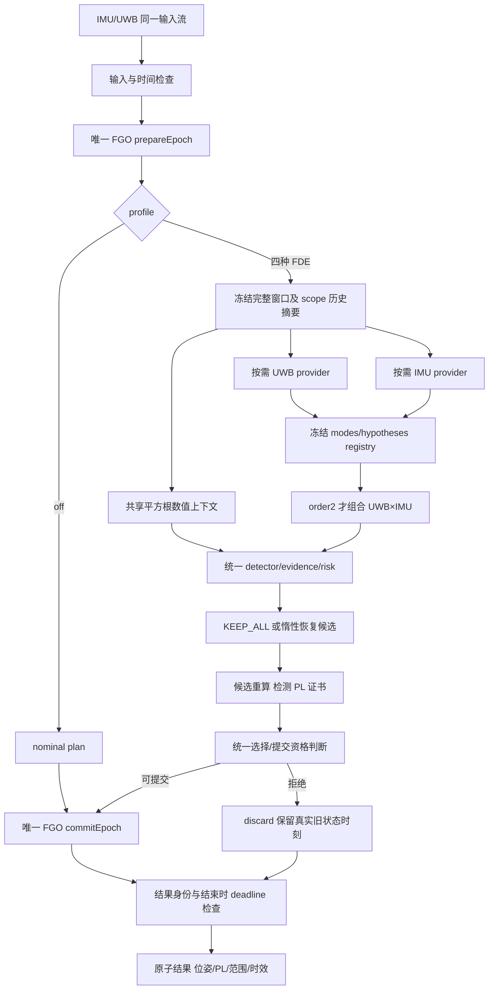

# UWB–IMU FGO 主线与可配置 FDE：架构、接口和实施验收规范

日期：2026-09-23。源码核对基线：`5a808ebda2d25fd13ee6af824c5230fcee73ffcc`。

状态：`DESIGN_READY_FOR_IMPLEMENTATION`。本文定义下一轮实现合同；新增接口、配置和命令均为待实现设计，不表示当前代码已支持。本文编写阶段不改变算法，也不宣称完成新的运行验证。开发者必须按第 12 节执行并交付第 13 节规定的实测报告。

## 1. 目标与交付边界

以唯一的 UWB–IMU 紧耦合 FGO 为主线，提供五种启动配置：`off`、`uwb_order1`、`imu_order1`、`joint_order1`、`joint_order2`。所有模式使用相同的状态、测量模型、IMU 预积分、UWB range factors、iSAM2/fixed-lag 后端和事务提交接口；模式决定监测范围及恢复动作。

实现交付必须依次回答：

1. 纯 FGO 能否持续、及时且正确地输出位置、姿态和速度？
2. 四种 FDE 模式是否生成正确的假设与动作，在正常及可恢复故障场景中计算对应输出的 PL，在不可监测场景中明确拒绝？
3. 每种模式的时间花在哪里，稳态、报警、成功恢复、持续拒绝和成熟窗口的成本分别是多少？

本轮包括配置、库接口、ROS 适配、离线实验入口、日志、测试、性能工具和文档。`archive/legacy-ie/` 保持历史归档。使用 snapshot/旧 conditional 方法的研究程序保留自己的方法标签，不得冒充五模式 FGO 验收。

新增 `custom`、运行时热切换、UWB×UWB、IMU×IMU、多轴共因、新传感器和高频外推器不属于本轮必需交付。先稳定五个 profile；不引入第二套 FGO 或四套复制的完整性管线。

真实传感器校准、独立数学评审及罕见事件风险证明仍是正式保护资格的独立前提。研究模式可以通过模型内数值验证，同时保持 `formal_eligible=false`。不得通过翻转此标记、放宽风险阈值或删除故障族取得验收通过。

## 2. 源码现状与必须修正的认识

| 现有位置 | 当前事实 | 本轮要求 |
|---|---|---|
| `config/integrity_config.hpp/.cpp` | 强制 UWB 三类、IMU accel/gyro 模型开启；禁止全部假设关闭 | 接受五种 profile，按依赖校验 |
| `integrity/hypothesis_generator.cpp` | 无条件构建 IMU 六轴 modes；一阶/二阶可选 | 按 scope 调用 provider，二阶包含一阶 |
| `integrity/integrity_monitor.cpp` | 统一大管线，先要求 IMU fault sensitivity 有效 | 纯 FGO 提前分支；UWB-only 不依赖 IMU fault sensitivity |
| `integrity/history_fault_parameterization.cpp` | 同时构建 UWB、IMU 历史故障列 | 当前、历史、覆盖和风险使用同一 scope |
| `estimation/incremental_estimator.cpp` | 已有 prepare/window/commit/discard | 复用，并分离 nominal 准备与昂贵完整性材料 |
| `integrity/joint_window_detector.cpp` | 双通道结果存在，但主判决仍采用 pooled 结果 | 固定并接通一致的检测/PL 合同 |
| `integrity/protection_level_v2.cpp` | pooled 模型 PL 已有实现 | 作为旧模型参考；目标 PL 消费双通道证书 |
| `tools/run_realtime_integrity.cpp` | 位姿、状态分 topic；异常分支存在旧状态改时间戳行为 | 保留真实状态时刻，新增原子复合输出 |

上述相对源码位置均位于 `include/uwb_imu_pl/` 或 `src/uwb_imu_pl/`，具体清单见第 11 节。

本设计修正此前讨论中的几处不严谨表述：

- `fixed_lag_epochs=200` 是逻辑 epoch 数。后端 `KeyTimestampMap` 写入 epoch index，不是秒；连续 20 Hz 提交时约为 10 s。完整性窗口 `intervals=10` 约为 0.5 s。拒绝会使实际跨度增加，报告必须同时记录 epoch 和秒。
- 关闭 IMU FDE 不等于停止 IMU 融合，更不等于 IMU 无故障。
- 未监测故障可能不触发报警，不能要求系统识别每一个范围外故障；必须保证不声称覆盖该故障族。
- `off` 无 PL 是正确行为，不允许以零 PL 或协方差标准差冒充 PL。
- 不用“代码完成百分比”衡量交付；按可执行验收项判定。

相关背景：[开发总报告](UWB_IMU_PL_开发情况与测试结果总报告.md)、[系统审计](UWB_IMU_PL_系统审计与复现报告.md)。审计文档在本次核对时是工作区未跟踪文件；设计依据同时由源码核实，不能假定新 clone 已包含该文件。

## 3. 五模式合同

| profile | 使用 UWB/IMU 估计 | UWB 单事件 | IMU 单轴区间事件 | UWB×IMU 联合事件 | 允许的恢复动作 | PL |
|---|---|---|---|---|---|---|
| `off` | 两者 | 无 | 无 | 无 | nominal commit；输入/数值错误拒绝 | `NOT_COMPUTED` |
| `uwb_order1` | 两者 | 开 | 关 | 无 | KEEP_ALL、UWB 排除/历史替换 | UWB 范围内 |
| `imu_order1` | 两者 | 关 | 开 | 无 | KEEP_ALL、IMU 区间替换/bridge | IMU 范围内 |
| `joint_order1` | 两者 | 开 | 开 | 无 | 两类动作及有覆盖依据的 union | 全部声明单事件 |
| `joint_order2` | 两者 | 开 | 开 | 开 | 两类动作及有覆盖依据的 union | 单事件及声明跨传感器双事件 |

UWB 单事件保留现有三种时间形状：单 epoch 偏置、持续常量偏置、仿射 ramp。IMU 保留 accel xyz、gyro xyz 的单轴区间常量事件；六轴是六类候选单事件，不是一个六轴共因事件。ramp 的两个参数仍属于一个物理事件，不能按参数列数算双故障。

`joint_order1` 的假设集为 `H_U ∪ H_I`；`joint_order2` 为 `H_U ∪ H_I ∪ H_UI`。`H_UI` 只包含能力清单允许、参数语义一致的跨传感器组合。零故障 nominal 情形始终存在，即使不作为有编号的 fault hypothesis 存储。

二阶表示“最多两个声明事件”，禁止在这五种模式中配置“只有二阶、没有一阶”。结构上的参数可分离不等于概率独立；不得默认用两个先验概率的乘积作为联合故障概率。

### 3.1 假设阶数、排除动作与检测范围

`max_fault_order` 与 `max_exclusion_cardinality` 分离。单故障下可能无法区分两个解释，需要保守 union 排除；动作排除数量不用于推断同时发生几个故障。健康帧只需 KEEP_ALL，报警后才物化恢复动作。

所有 FDE 模式仍在完整融合窗口上检测，保留 UWB 与 IMU 的正常测量约束和相关性。UWB-only 不表示把检测矩阵裁成仅 UWB 行；IMU-only 同理。裁剪对象是故障映射列、假设和动作权限。

传感器健康管理仅能为激活的故障族生成 FDE 恢复动作。所有模式继续做时间戳、有限值、合法 anchor、IMU gap、矩阵有效性和队列检查。不可把基本输入校验当成统计 FDE 开关一起关闭。

### 3.2 PL 的三层语义

必须分别输出：

1. 数值状态 `NOT_COMPUTED / FINITE / UNBOUNDED / INVALID`。
2. `within_alert_limits`：模型内有限 HPL/VPL 是否不超过预先冻结的告警限。
3. `formal_eligible / publication_protected`：校准、风险、覆盖、时效和证书条件是否全部满足。

有限 PL 不代表小于告警限；模型内覆盖测试通过不代表正式认证。单传感器 FDE 只能作条件于其他传感器正常的研究声明；如要提升正式资格，遗漏风险必须有独立依据并纳入账本。

## 4. 配置与兼容性

### 4.1 新 schema

新增 `uwb-imu-pl/v6`，单一模式来源为 `fde.profile`。本轮不再增加与 profile 重叠的 `integrity.enabled`、`uwb.enabled`、`double_faults_enabled` 开关。

以下为嵌入完整配置的新增/调整片段，不是可单独运行的完整 YAML：

```yaml
schema_version: uwb-imu-pl/v6
fde:
  profile: joint_order1   # off | uwb_order1 | imu_order1 | joint_order1 | joint_order2
  max_candidate_count: 128
  max_exclusion_cardinality: 2
  on_no_valid_action: discard
  on_integrity_model_invalid: discard

fault_models:
  manifest_path: integrity_fault_manifest.yaml
  # 保留现有各模型的数值参数，启用范围只由 profile 产生。

publication:
  allow_unprotected_output: true
  protected_output_enabled: false
  deadline_ms: 40.0

realtime:
  max_queued_events: 8192
  imu_overflow_policy: invalidate_and_reinitialize
  uwb_overflow_policy: drop_oldest_unprocessed_uwb
```

队列容量是本轮合成验证的初始上限，不是内存或实时性证明。超过上限必须产生带序号、时间范围和计数的事件；IMU 缺失不可静默跨越预积分。正常 200/20 Hz 验收不允许通过丢包获得性能通过。

`on_no_valid_action`、`on_integrity_model_invalid` 本轮 v6 只接受 `discard`。PL 超告警限或 formal 校准未完成本身不等同于没有有效估计动作：通过模型/检测的候选可以提交并输出 unprotected，但不能得到 protected 标记。detector 已报警且无有效动作时不得隐式提交嫌疑观测。

`off` 只依赖估计必需参数；缺少故障 manifest、risk、bridge 校准不阻止纯 FGO 启动。传感器噪声和 IMU 基本输入检查仍为必需。若用户提供非活动节，验证键名/类型并记录 `inactive`，不要求该模块的运行时资源有效。拼写错误仍拒绝。

profile 展开产生不可变的 `ResolvedFaultScope`，包含 family、形状、阶数、动作权限、检测合同、遗漏集合及版本摘要。所有结果与 resolved config 保存同一摘要。

### 4.2 v5 迁移

- v5 常规 `single=true,double=false` 映射 `joint_order1`；`single=true,double=true` 映射 `joint_order2`。
- v5 double-only 报明确迁移错误，指向旧研究入口；不得静默补齐 singles。
- v5 与新 profile 同时出现时拒绝，不做字段优先级猜测。
- profile 决定故障族；v6 拒绝旧 enable/order 重复字段。模型幅度、噪声、风险数值参数继续复用。
- 旧行为若因检测/发布缺陷修复而改变，记录预期差异，不能为了位级一致保留已确认缺陷。
- `manifest` 表示支持能力目录；resolved scope 表示本次激活集合。不得把目录中的全部 family 当成此次已监测范围。
- 五种完整示例配置由共同基线确定性生成或使用严格解析的公共基线＋覆盖生成器。ROS 最终读取展开后的单文件；避免未经定义的 YAML include/深层合并。
- launch 的可选 `fde_profile` override 必须在严格校验、序列化和哈希之前应用；CLI、ROS 和离线程序使用同一个 loader。

不支持在线热切换；节点运行中改变 profile 必须拒绝并要求重启。重启后重新初始化状态和历史，不能沿用旧 scope 的证书/摘要/health cache。

## 5. 架构与数据所有权



一个运行实例只有一个可写 FGO；为了比较五种模式，可在离线或不同 ROS namespace 中运行五个独立实例，各自读同一份冻结输入。不能让多个模式交替修改同一实例。

`RealtimeIntegrityPipeline` 是协调器；estimator 拥有后端、IMU 队列和 factor ledger；provider 只能读冻结材料、构造 modes/actions，不能 commit、修改权重或健康状态。候选计算只读共享上下文；选择后协调器更新 health 并调用唯一事务接口。

truth、故障注入标签只能进入测试生成端和离线评分端；生产估计/检测/选择禁止读 truth topic 或注入时刻来选择动作。

## 6. C++ 接口合同

下列为目标接口草图。新增类型须有头文件和序列化定义；实现可沿用现有类型避免大规模重命名，但输入/输出和所有权合同必须保持。

### 6.1 Scope

```cpp
enum class FdeProfile { Off, UwbOrder1, ImuOrder1, JointOrder1, JointOrder2 };
enum class SingleFaultFamily { UwbAnchor, ImuAccelAxis, ImuGyroAxis };
enum class PairFaultFamily { UwbImu };

struct ResolvedFaultScope {
  FdeProfile profile;
  std::vector<SingleFaultFamily> singles;  // 规范排序，无重复
  std::vector<PairFaultFamily> pairs;
  unsigned max_fault_order;              // off=0，order1=1，order2=2
  std::string detector_contract_id;
  std::string manifest_digest;
  std::string scope_digest;              // 含模型/动作/遗漏范围版本
  bool requiresUwbFaults() const;
  bool requiresImuFaults() const;
};
```

`resolveFaultScope(config, capabilities)` 是唯一展开位置。缓存、历史摘要、risk、PL 与 publication 均绑定 scope digest。稳定物理事件 key 必须包含 family/source/onset/support/shape；模式计数变化不能改变同一事件的物理身份。运行局部整数 ID 可以变化，但不能代替稳定身份做跨 profile 比较。

### 6.2 FGO 准备和提交

复用 `IncrementalUwbImuEstimator::ingestImu/prepareEpoch/commitEpoch/discardEpoch/currentState`。

`prepareEpoch` 的目标参数扩展为 `EpochPreparationOptions`，只表达所需材料：nominal factors、冻结窗口材料、UWB recovery 材料、IMU bridge 材料。协调器从 scope 推导这些要求，不把具体 profile 判断散布到估计器内部。

`off` 路径：

```cpp
auto tx = estimator.prepareEpoch(batch, nominalPreparationOptions());
auto plan = EpochCommitPlan::nominalPlan(tx);
plan.best_effort_integrity_unavailable = true;
auto receipt = estimator.commitEpoch(std::move(tx), plan);
// 输出必须来自 currentState()/receipt，不能输出 nominal_predicted_state 代替优化结果。
```

前置输入检查、优化成功、有限状态及四元数有效性仍执行；失败返回明确原因。off 不要求构建完整性窗口，不计算 fault sensitivity/PL，不构造 bridge 候选，不等待 risk/manifest/保护资格。底层优化异常若已部分修改后端，标为 poisoned 并受控重初始化，不假装实现回滚。

`prepare/discard` 后 backend update 增量为 0；成功 `commit` 恰好为 1；同一事务不可重复提交。测量被拒绝后，IMU 消耗/保留和下次积分边界由既有 cursor 合同管理并测试。

### 6.3 Provider 与组合器

```cpp
struct FaultBuildContext {
  const EpochTransaction& transaction;
  const LinearizedIntegrityWindow& window;
  const ResolvedFaultScope& scope;
};

class FaultFamilyProvider {
 public:
  virtual ~FaultFamilyProvider() = default;
  virtual void appendCurrentModes(const FaultBuildContext&,
                                  FaultModeRegistry&) const = 0;
  virtual void appendHistoricalColumns(const HistoricalEpochContext&,
                                       HistoryFaultRegistry&) const = 0;
  virtual ExclusionAction buildAction(const FaultBuildContext&,
                                      const FaultModeBasis&) const = 0;
};
```

UWB provider 复用现有三种 raw map 和保留测量协方差重白化；IMU provider 复用 analytic sensitivity 和区间 bridge。可以用组合/具体类而非虚继承实现，禁止借接口重构重写已验证数值算法。

UWB-only 不调用任何 IMU **故障灵敏度**构建/校验，IMU 正常预积分仍执行。IMU-only 不构建 UWB fault maps，但 UWB 正常测量因子和协方差保留。关闭某 provider 后，其数据依赖不能成为该 profile 的失败条件。

`HypothesisGenerator` 调用激活 providers；独立 `PairHypothesisComposer` 只在 order2 调用。registry 冻结后不得在候选阶段删减“难算”的 hypothesis；各候选的残余故障映射必须从同一声明范围推导。

### 6.4 历史摘要

将 `planHistoryFaultParameterization` 扩展为显式接收 scope/provider 集合；当前和历史必须使用同一物理故障定义。仅减少故障列，不删除正常历史估计信息或残差能量。

初次落地可保留全量历史摘要作为参考，但每模式必须独立测量其成本。若不满足运行预算，实施增量 QR/摘要更新并与参考逐帧对比；不以缩短窗口、隐藏拒绝或减小声明范围充当优化。

摘要 identity 包含 scope、horizon、graph/linearization/noise 版本和三项容量限制。`max_summary_rows/max_perp_rows/max_fault_columns` 都要实际执行；超限明确 REFUSE，禁止截断故障列。恢复到边界外的故障只能记录 uncovered/omitted，不能伪造完整历史覆盖。

### 6.5 检测、候选与 PL

目标检测合同固定为 `dual_channel_v1`：当前与历史通道接受条件同时成立；零历史自由度使用显式的退化合同，并通过 oracle 验证。pre-FDE、post-FDE 和 PL 必须引用相同合同、阈值、自由度、窗口及 scope。

复用 `dual_channel_detector.cpp` 和 `computeDualChannelBound()`，在候选自己的冻结模型中构建对应通道和联合界证书。将证书作为 PL 输入，禁止主判决用 dual-channel、PL 却使用 pooled 非中心界。

旧 pooled 路径只允许显式标为 `legacy_pooled_reference` 的离线参考，不进入五模式目标验收。若双通道接线尚未完成，相关 gate 为 BLOCKED，不能因模块单测通过宣称 PL 已正确。

候选动作须符合 scope 权限、覆盖全部应解释假设，经过数值/可观性、post-detector、risk 和模型检查。IMU bridge 的确定性误差界不能当高斯测量方差；单轴故障的实际动作可能替换整个 IMU 预积分区间，报告必须记录真实移除粒度。

FDE 保证组只在转移/共享事件证明成立时合并；先把所有候选送入分组器，再决定合并。不得按相同 plausible set 预去重而少计选择风险。不支持或不确定时明确拒绝。

PL 的保护量固定为 world frame 中的 body origin position；状态的 tag lever arm、保护点 Jacobian、HPL 合成方法必须保持一致并进证书。位置 PL 不提供姿态误差保证，姿态正确性另行验证。

### 6.6 输出、证书和时效

新增 `NavigationIntegrityResult` 原子输出，至少包含：

| 类别 | 必需字段 |
|---|---|
| 身份 | run_id、attempt_id、transaction_id、solution_id、config/scope/manifest digest |
| 时间 | attempted_timestamp、state_timestamp、publish_timestamp、arrival/finish steady 时间、state_age、deadline_missed |
| 导航 | pose、velocity、IMU bias、state_valid、fresh、commit/discard 原因 |
| FDE | profile、family/阶数、detector contract、selected action、hypothesis/action census |
| PL | pl_xyz、HPL/VPL、数值状态、within_alert_limits、风险状态、formal_eligible |
| 发布 | publication_protected、certificate_id、reason_codes |

内部可扩展 `IntegrityOutput`；ROS 新增 `NavigationIntegrity.msg`，包含 Odometry 和 IntegrityStatus 及配对身份，发布 `/uwb_imu_pl/solution`。旧 odometry/status 为兼容镜像，使用相同 solution ID；旧 odometry 明确为 best-effort，header.stamp 为真实 state timestamp。

off：`pl_status=NOT_COMPUTED`、数值用 `+inf`、`detector_status=NOT_RUN`、`formal_eligible=false`、`reason=FDE_DISABLED`，不得把未执行 detector 标成通过。JSON 不写非标准 Infinity，使用 null 配合 status；CSV/ROS 可用 inf 并保留 status。

拒绝：保留 last committed state timestamp，另给 attempted timestamp；不允许给旧状态盖新时间戳。IMU gap/异常恢复分支同样遵守。

内核生成不可变证书，发布层只校验。证书绑定实际解、PL 数值/单位、告警限、frame/reference、scope、detector/risk/history digest；测试修改单个 PL bit、交换 epoch、遗漏 status 均须失配。

时效使用 steady clock：在开始、重计算结束、commit 前及 publish 前检查。commit 前超时可 discard；commit 已发生后超时禁止“撤销成功”假记录，应保留真实 commit 并降为 unprotected/late。端到端性能另含排队和发布，不能只用开始时 watchdog。sensor time 与 wall time 不混算；模拟时钟暂停、回退单独处理。

## 7. 必须成立的不变量

| ID | 要求 |
|---|---|
| INV-01 | 所有 profile 的 nominal FGO 都含正常 UWB、IMU；使用同一因子实现 |
| INV-02 | 每 epoch 只有一个主后端写入者；prepare/discard=0 次更新，commit=1 次 |
| INV-03 | off 无完整性窗口/故障历史列/sensitivity/候选 PL 运算，正常 FGO 边缘化继续 |
| INV-04 | inactive provider 的 mode/action/sensitivity 计数为零，正常观测行仍存在 |
| INV-05 | order2 的 single 物理事件集合包含 order1；pairs 只为声明 UWB×IMU |
| INV-06 | scope 一致贯穿当前/历史/候选/风险/PL/日志/缓存；错配拒绝 |
| INV-07 | 无可提交动作时 discard；没有 formal 资格不阻止合法 unprotected 导航输出 |
| INV-08 | 旧状态不改戳，有限 PL/告警限内/正式保护三个量分别记录 |
| INV-09 | active scope 是条件性保护声明，未监测故障不被暗示已覆盖 |
| INV-10 | 提交最终非线性解须与 PL 所保护解一致；变化超过数值合同则证书失效 |

模式之间只有在同一输入、同一初始状态、相同已提交历史且都选 KEEP_ALL 时才要求状态等价。发生不同拒绝/排除后轨迹自然不同，不得无条件要求五模式位姿一致。

## 8. 验证协议与验收门

### 8.1 冻结实验协议

新增机器可读 `config/fde_profiles_validation.yaml`，在正式运行前固定：代码 SHA/dirty diff hash、配置、输入数据 hash、硬件、依赖版本、噪声定义、seed、初始化误差、轨迹、锚点、故障范围、各数值阈值、运行量和截止条件。任何调整产生新 protocol ID，保留失败结果。

优先复用现有 simulator/raw-stream runner；补充有充分三维平移和转动激励的轨迹、非零 lever arm、随机 IMU/UWB 噪声、初值误差。使用 `covariance_mean` 的 1.5 s smoke 只作代数回归，不能作为精度或可用性验收。

噪声密度和离散采样噪声需按实际模型转换并用样本统计验证，不能把相同 sigma 直接用于两者。运动真值须与比力、角速度和 UWB range 生成一致。

### 8.2 Gate FGO：首先验收主线

以下是本轮明确的合成基准工程目标，非真实设备精度声明。正式数据集另冻结指标，不能直接套用本表：

| 场景 | 样本量/条件 | 通过条件 |
|---|---|---|
| 无噪声解析一致性 | ≥10 s，有姿态变化/非零 lever arm | 位置 RMSE ≤1 cm，姿态 SO(3) geodesic RMSE ≤0.01 rad；采样积分误差注明 |
| 短段 batch 对照 | 与主线相同因子/先验/观测，充分收敛 | 位置差 ≤1 mm，旋转差 ≤1e-3 rad；若不同线性化策略有差异须查明，不预设全部位级一致 |
| 随机 nominal | 20 个固定 seed，每个 60 s，8 个非共面锚点，IMU 200 Hz/UWB 20 Hz，噪声按协议 | 每 seed 位置 RMSE ≤0.20 m、P95 ≤0.50 m；姿态 RMSE ≤0.10 rad；速度 RMSE ≤0.20 m/s；有效新状态率 ≥99%（初始化后） |
| 初值误差 | 协议固定 0.2 m 位置、0.2 m/s 速度、5° 姿态误差，各轴/符号覆盖 | 10 s 后达到 nominal 指标；不得用真值重初始化 |
| 弱可观/退化 | 静止、平面/差几何、yaw 弱激励 | 独立报告，不混入充分激励验收；不伪称完整姿态保证 |
| 成熟与持续运行 | 至少 3×fixed_lag_epochs 成功提交；最终 600 s 实时流 | 有真实边缘化；状态/内存/队列有界；误差、freshness 和性能同时通过 |

使用固定世界坐标直接比较，不以自由 SE(3) 对齐掩盖坐标错误；ATE、RPE、姿态角误差、速度及 bias 误差都输出。bias 收敛按激励条件单列，弱可观结果不合并平均。

同时计算 truth-at-state-time 的估计误差和 truth-at-attempt-time 的服务误差；stale 输出单独计数并进入服务失败率，不能只在历史时刻算小误差掩盖输出延迟。

### 8.3 Gate PROFILE：模式、事务、权限

五种模式 × nominal/UWB 故障/IMU 故障/联合故障/退化/历史跨窗/拒绝恢复。至少验证：

- scope 与 hypothesis census、动作权限、历史故障列相符；off 全零。
- 用“inactive sensitivity 若被调用即失败”的替身测试 UWB-only 独立性；不破坏正常 IMU 预积分。
- order2 singles 集合与 order1 按稳定 key 相同，并含合法 pair；不对重新分配预算后的 PL 强行要求单调。
- 无报警 KEEP_ALL 的历史相同用例验证 FGO 等价；报警后验证相应排除、bridge、commit/discard。
- 物理故障阶数与 union 排除数量分离；IMU 六轴分别注入。
- 未监测故障测试记录行为及条件性 scope，不要求不可能保证的“必定检测”；所有无校准输出仍不能 protected。
- 并发候选使用 1/4 workers 时决策/PL 在合同容差内一致。

### 8.4 Gate PL：必须有正向结果，负向拒绝不能替代

测试分三层：独立数学 oracle、原始传感器流的端到端行为、概率证据。oracle 不复用被测 helper，以避免自证。

数值容差继承现有 ADR，按统计量/解/PL 的类别固定。测试接近 rank/condition/阈值边界；`pooled pass + 单通道 fail`、零历史自由度、联合不可监测、post-FDE 模型变化均有反例。不可监测返回无界是合法且必须的。

每个 active profile 必须有：

1. nominal 正向场景：有效窗口形成后模型内有限 PL 比例 ≥95%，实际误差与 PL 同一时刻同一保护点。
2. 每个激活单故障族至少一个预先定义的可恢复场景；恢复后连续 ≥20 epoch 有限 PL，记录正确动作、位置/姿态误差、bridge 成分和健康状态。
3. order2 至少一个真实重叠 UWB+IMU 注入，经完整 FDE 选择后恢复有限 PL；不以两个不重叠单故障替代。
4. nominal 可用性目标：固定 2 m/3 m 告警限下 `within_alert_limits` ≥90%；可恢复故障恢复段目标 ≥80%。这些是工程目标，失败时单列 `PL_NUMERICS_PASS / OPERATIONAL_AVAILABILITY_FAIL`，不能改阈值假称通过。
5. 不可恢复、低冗余、持续不可监测/模型无效场景明确 UNBOUNDED/INVALID/UNAVAILABLE，不以强行生成有限数值为目标。

分别统计故障前、报警期间、排除后和恢复后；禁止用前 24 帧的有限覆盖证明第 25 帧以后故障 PL 正确。对每个故障配置幅值/起止/轴做小网格扫描；强故障压力用例与物理合理故障分开，现有 ~1582 m/s² 合成注入不得独占 IMU 正向验收。

工程 MC 最少 20 seeds × 60 s/标准场景，报告有限输出分母、越界、误报、漏检、检测延迟及置信区间。序列相关样本不能当独立 Bernoulli 样本套置信上界；按独立试验/轨迹定义事件。零越界不证明极小 HMI 风险。独立样本零失败时单侧 95% 上界 `1-0.05^(1/N)` 仅在样本独立、事件定义一致时适用。正式风险 campaign 和 Gate J 缺失时报告 `NOT_VALIDATED`。

### 8.5 Gate OUTPUT：最终输出正确

覆盖最终提交解与证书对应、scope 错配、交换 epoch、篡改 PL、ROS topic 配对、旧状态时间戳、单次调用内部超时、clock pause/rollback、掉包和 IMU gap。必须测试真实 ROS adapter，不能只测试库。

所有新门使用 `PASS / FAIL / BLOCKED / NOT_RUN`，每项提供证据路径。新的 profile protocol 与旧 Gate D 是不同协议，不能把新结果覆写为旧 Gate D PASS。

## 9. 全模式耗时分析

### 9.1 同一口径

所有模式使用同一数据文件、seed、初始状态、噪声、lag、窗口、编译参数、硬件和日志档位。模式改变导致的 FDE 轨迹不同属实测结果；另外用冻结相同窗口的 replay 分离算法成本。

逐 epoch 输出 attempt/commit/reject、hypothesis/action 数、实际测量数、窗口行列、历史行/列、backend 活动量、pending 时长、state age、queue depth、RSS、分解/求解计数。关闭阶段标 `SKIPPED_PROFILE`，时间为 0；未采集时间为空，不能混写零。

计时字段必须区分 inclusive/exclusive 和 thread CPU/wall。父阶段包含子阶段时不能相加两遍；并行 worker 的累计时间不作为主线程 wall time。每个 epoch 记录独立 total 与未归属时间，再对 total 求分位数，禁止相加阶段 p99。

| 阶段 ID | 测量边界 |
|---|---|
| `input_validation` | 消息转换与合法性检查 |
| `imu_ingest` | UWB 间隔内各次 IMU 入队/处理累计，单独报 CPU/wall |
| `prepare_epoch` | 预积分、nominal factors 和必要事务材料 |
| `window_current` | 当前窗口组装/线性化 |
| `history_parameterization` | 激活 family 的历史列计划/构造 |
| `history_summary` | 边界提取、消元与摘要更新 |
| `shared_numerics` | 共享 QR、rank/condition 和必要 RHS |
| `uwb_modes` / `imu_sensitivity` / `imu_modes` | 按 provider 拆分 |
| `hypothesis_compose` | singles 注册、pair 组合 |
| `detector_evidence` | 检测/假设证据计算 |
| `health_actions` | 健康更新和候选构造 |
| `candidate_evaluation` | 候选总 wall；子项 post-detector、PL、risk 单独跟踪 |
| `selection_certificate` | FDE 风险选择及证书冻结 |
| `commit_state` | 后端更新、边缘化和状态查询 |
| `publication` / `logging` | 输出与日志实际成本 |
| `core_total` | processUwbBatch 进入到返回 |
| `arrival_to_publish` | 该 UWB 到达本机 steady 时刻至实际发布，含排队 |
| `sensor_to_publish` | 只在时钟同域/经验证同步时计算，否则 N/A |

off 仍要报告完整端到端成本，不能只计 iSAM2 update。异步日志如使用后台队列，必须报告积压、丢失、最终 flush 和开销，不能把工作移走后隐藏成本。

### 9.2 运行矩阵与目标

每模式测试 cold start、成熟 nominal、报警、成功 FDE（off 为 N/A）、持续拒绝/恢复。成熟段须由实际 `marginalization_count>0` 和成功提交数判断，不靠请求 epoch 自动划分。

按以下规模推进：30 epoch smoke → 600 epoch pilot → 主线 600 s 实时运行 → 各模式 12000 输入 epoch、100 预热、3 repeat 的全链路 benchmark。全跑前用 pilot 估算成本；若单帧秒级，先定位修复，再续跑。预检因时限中止时记 `ABORTED_BUDGET` 和已处理分母，不宣称通过，也不无限重复长跑。

本轮工程实时目标：200 Hz IMU、20 Hz UWB；每次 repeat 的 `core_total p99≤40 ms`，`arrival_to_publish p99≤50 ms`；正常流 deadline miss 比例 ≤1%，无持续队列增长/正常输入丢弃。报告 max，不能把 p99 宣称硬实时最坏时延保证。

off 必须通过位姿和实时目标后才进入后续模式正式验收。四种 FDE 模式均测同样目标，未达到的模式标 `REALTIME_FAIL`，总体完整交付不得标全通过。如数学正确但历史计算成本失败，保留该阶段结果和下一项优化证据。

RSS 初始合成运行预算为 1 GiB；记录启动峰值、成熟高水位及最后两个等长区间增长，最后区间峰值相对前一区间不得增加超过 10%。同时验证各队列/ledger/cache 的配置上限；RSS 单项平稳不代替结构有界证明。预算变更须新 protocol，并注明适用硬件。

### 9.3 性能优化边界

先消除 inactive provider、off 完整性准备的成本；再测历史摘要、候选和日志。若历史为瓶颈，做增量摘要且逐帧验证统计量、故障响应、rank/dof、PL/决策等价。不得因关掉 FDE 或减少支持范围后的速度提升，就宣称 joint 模式已优化。

## 10. 自动化工具合同

新增统一工具 `tools/run_fde_profile_validation.py`、`tools/analyze_fde_profile_runs.py`，复用现有 runner、logger、schema validators 和 simulator。拟交付命令如下，当前尚未实现：

```bash
python3 tools/run_fde_profile_validation.py --protocol config/fde_profiles_validation.yaml --gate fgo --output results/fde_profiles/fgo
python3 tools/run_fde_profile_validation.py --protocol config/fde_profiles_validation.yaml --gate profiles --profiles all --output results/fde_profiles/profiles
python3 tools/run_fde_profile_validation.py --protocol config/fde_profiles_validation.yaml --gate pl --profiles active --output results/fde_profiles/pl
python3 tools/run_fde_profile_validation.py --protocol config/fde_profiles_validation.yaml --gate performance --profiles all --output results/fde_profiles/performance
python3 tools/analyze_fde_profile_runs.py --input results/fde_profiles --report doc/UWB_IMU_FGO_FDE_IMPLEMENTATION_REPORT.md
```

工具预检能力/配置/依赖；失败非零退出；支持按 run manifest 断点续跑，但 input/config/code/protocol hash 不同时拒绝复用。truth 与故障标签由 evaluator 关联，不能传入生产 API。

最少产物：resolved YAML、manifest.json、states.csv、ground_truth.csv、integrity.csv、attempts.csv、stages.csv、fault_truth.csv、summary.json、validation.json、完整 stdout/stderr。每个摘要关联原始产物 SHA-256。大文件不入 Git 时提供可访问的持久制品位置和获取命令；`/tmp` 不是最终证据库。

## 11. 实现文件地图

| 文件/模块 | 修改内容 |
|---|---|
| `include/uwb_imu_pl/config/integrity_config.hpp` | profile、scope、preparation/output policy；移除新 schema 重复 enable 来源 |
| `src/uwb_imu_pl/config/integrity_config.cpp` | v5 迁移、v6 严格解析、单点展开、override/hash |
| `config/integrity_fault_manifest.yaml` 及 loader | 能力目录与 active scope 分开；遗漏范围明确 |
| `estimation/epoch_transaction.hpp` | preparation options、可选材料和 nominal 合同 |
| `estimation/incremental_estimator.hpp/.cpp` | nominal 轻路径、scope 历史材料、真实 state timestamp |
| `integrity/hypothesis_generator.hpp/.cpp` | provider、registry、pair composer 和 action 权限 |
| 新 `integrity/fault_scope.*` / provider 文件 | 统一 scope/稳定身份，按需提取现有算法；路径由实现固定 |
| `integrity/history_fault_parameterization.*` / `history_summary_*` | scope 历史列、三项容量、版本和增量/参考对照 |
| `integrity/integrity_monitor.hpp/.cpp` | off 分支、四模式共用编排、失败策略、结束时检查 |
| `integrity/joint_window_detector.*` / `dual_channel_detector.*` | 一致双通道生产判决 |
| `integrity/protection_level_v2.*` | 消费同一候选/检测/范围证书 |
| `integrity/fde_manager.*` / `fde_post_selection.*` | 先证明后合组、动作 eligibility、选择风险 |
| `integrity/publication_identity.*` | 内核冻结证书、PL 绑定、结束时 deadline |
| `common/types.hpp` / `io/run_logger.*` | PL 数值状态、profile/scope、原子结果、阶段 trace |
| `msg/IntegrityStatus.msg`、新 `msg/NavigationIntegrity.msg` | scope、配对身份、状态/尝试时刻、数值/正式状态 |
| `tools/run_realtime_integrity.cpp`、`launch/*.launch` | 统一 override、新消息、队列边界、计时与真实时间戳 |
| `apps/*` 生产 pipeline 调用者 | 统一 loader/profile，取消未记账的 C++ 临时覆盖 |
| `tools/*` schema/分析、`test/*` | 新字段兼容、模式与行为验证、指标门 |
| `CMakeLists.txt`、`package.xml` | 新源码/消息/测试/工具安装；仅确有需要时增依赖 |
| `README.md`、当前 conventions、runbook | 新入口、能力与限制；旧报告注明历史基线，不覆盖 |

## 12. 给 Codex 的实施顺序与退出条件

每阶段提交可审查的代码、测试和结果；先检查用户已有改动，保留未跟踪审计文档。实现阶段遵循仓库现有指令。本文不授权发布远端或修改设备。

| 阶段 | 工作 | 退出条件 |
|---|---|---|
| P0 基线冻结 | 记录 SHA/diff、构建现状、原测试结果、输入与实验协议 | 可复现现状；不得误用旧结果认证新代码 |
| P1 scope/config | v6、五配置、v5 迁移、能力校验和 hash | 合法/矛盾/缺依赖配置及稳定展开测试通过 |
| P2 主线 FGO | off、轻量 preparation、真实时间输出、输入/异常处理 | Gate FGO 精度与实时通过；否则先诊断修复 |
| P3 模块拆分 | providers、当前/历史 scope、actions/health/风险一致 | 五模式 census/权限/事务测试通过；现有算法 oracle 保持 |
| P4 保护链 | 双通道生产接线、候选 PL、风险分组、证书/结束时门 | Gate PL 数值/正向恢复和 Gate OUTPUT 通过；未校准仍 false |
| P5 全流验证 | 带噪声/初值/各轴/联合/历史/退化原始输入 | 逐模式报告准确性、有限 PL、可用性和失败原因 |
| P6 性能 | pilot、热点优化、等价性复核、全矩阵 | 每模式成本表、实时判定和资源边界；不能隐藏超时样本 |
| P7 交付 | 完整构建/相关回归、ROS、报告、README | 可一键重跑，报告每项 PASS/FAIL/BLOCKED/NOT_RUN |

算法修复与接口重构尽可能分开评审，但已确认阻塞正确 PL 的问题必须在 P4 解决。不要为保护旧测试期望而绕过它。阶段失败需要给最小复现、原因、修复及回归；实在需要新数学模型或外部数据时明确报告边界，不能把任务降格为仅改配置。

完成判断为逐门合取，不能由单元测试总数代替。所有 active 模式只输出 inf 时，负向安全测试可通过，正向 PL 交付失败；纯 FGO 无 PL 则是设计通过。真实数据缺失时，研究实现可有完成结果，但正式部署资格仍 BLOCKED，必须在最终报告分开陈述。

## 13. 开发后报告要求

开发完成后生成 [UWB_IMU_FGO_FDE_IMPLEMENTATION_REPORT.md](UWB_IMU_FGO_FDE_IMPLEMENTATION_REPORT.md)。本设计阶段仅提供模板，所有实测格保持 `NOT_RUN`；不得把旧 50 s/帧等性能数据填成新系统结果。

报告必须包含：最终架构/分支图、文件/API 变更、完整配置和启动命令、硬件/依赖/代码/数据 hash、五模式位姿/PL 验收表、故障前中后统计、每阶段耗时和端到端时间、成熟期资源曲线、失败用例、已知限制、复现/取证步骤，以及按实测占比排列的后续优化项。

每项耗时链接到相同 run_id 的原始 trace；汇总列出有效/拒绝/超时/中止的完整分母。结论分别回答主线实时正确性、模式功能、PL 数值正确性、告警限内可用性、正式资格及实时性，禁止以单一“全通过”掩盖任何未过的门。
