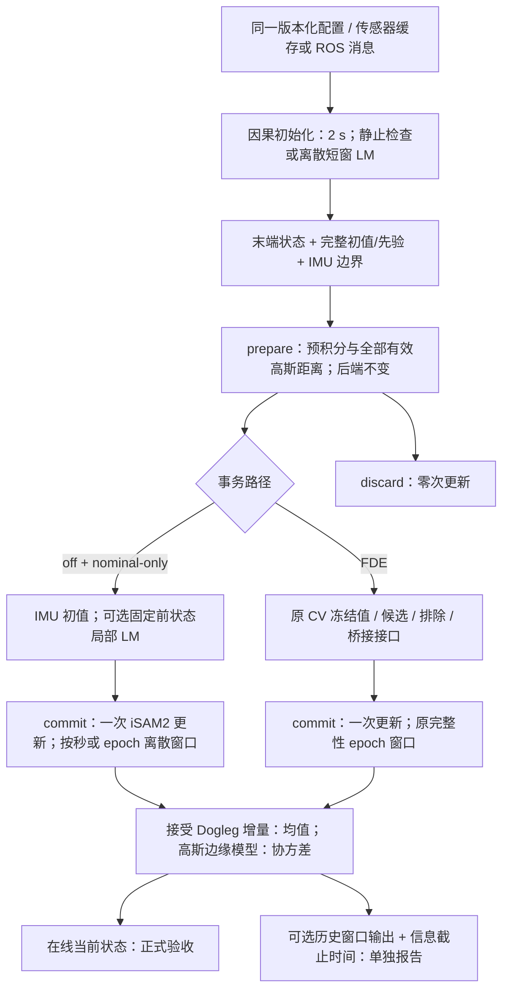

# 离散时间 UWB–IMU 无 FDE 精度改进：实施与验收

本次实现保留离散 15 维状态、Combined IMU 预积分、距离因子和 iSAM2 固定滞后后端。没有引入连续时间样条、额外重力状态或在线世界坐标变换状态。新增优化均可通过版本化 sidecar 配置控制；旧入口配置和 FDE 对象布局保留。

**本次交付不能视为全部验收通过，也不自动升级无 FDE 推荐配置。** 精度目标、失败率、性能和完整回归结论见下方最终数据。正确性修复与实验优化分别记录；鲁棒实验和历史平滑不计入正式 nominal 验收。

依据：[原代码流程分析](nominal_vs_sfuise_code_flow_analysis.md)、[原精度/耗时报告](uwb_imu_accuracy_timing_report.md)、[数值与事务契约](../../doc/adr/0002-integrity-v2-numerical-contract.md)。旧报告、旧配置和旧冻结证据均未覆盖。

## 1. 实现与接口边界

| 改动 | 实现位置 | 行为与边界 |
|---|---|---|
| Dogleg 接受解查询 | [incremental_estimator.cpp](../../src/uwb_imu_pl/estimation/incremental_estimator.cpp) | 每次后端更新后缓存一次 `getDelta()` 引用，pose/velocity/bias 从线性化点 retract；历史查询复用该接受步。移除均值路径的完整高斯回代，协方差仍取原高斯边缘模型。 |
| 显式偏置积分协方差 | 同上、[estimation_tuning.cpp](../../src/uwb_imu_pl/estimation/estimation_tuning.cpp) | `biasAccOmegaInt = diag(bias_integration_sigmas²)`；未配置时显式使用初始化偏置先验协方差。独立于 Combined IMU 自带随机游走，未重复加因子。 |
| 因果初始化 | [causal_initializer.cpp](../../src/uwb_imu_pl/estimation/causal_initializer.cpp) | 只用首个 IMU 后 2 s 内的传感器数据；状态落在窗口末端。检查至少 1 s 的连续静止段；静止时估计倾斜、gyro bias 与重力方向 accel bias，航向先验 sigma 为 π。动态启动用 11 个离散状态、10 个 IMU 区间和距离因子，LM 最多 5 轮；缺少 4 个 anchor、缺 IMU、非有限值或不可解时失败。 |
| 动态初始化先验 | 同上 | 保留终端 pose/velocity/bias。接口只传对角先验，因此用联合协方差每行绝对值之和构造对角上界，避免丢弃交叉项后过度自信；这仍是局部线性协方差近似。 |
| 两入口一致 | [direct runner](../../apps/nominal_dataset_runner.cpp)、[ROS 入口](../../tools/run_realtime_integrity.cpp) | 启用因果启动后调用同一初始化器，完整传递时间、姿态、位置、速度、两类偏置和先验。统一 IMU 边界，消耗初始化数据后从严格晚于窗口末端的 UWB 开始。旧配置不启用该选项时保留旧启动方式。 |
| nominal 初值与 LM | 共用估计器 | `fde=off` 的 nominal-only 事务可用 IMU prediction 作初值。可选 LM 固定上一接受状态，只优化新 15 维状态，最多 5 轮；检查白化代价与有限值，失败或未降低代价时回退 IMU prediction。LM 不向后端增加先验或量测。 |
| 按秒滑窗 | 共用估计器 | nominal 支持实际时间戳和 2/5/10 s 窗口；0 保留原 epoch 窗口。处理稀疏 epoch 中“新 IMU 因子立即进入 Schur 边界”的生命周期；此处理只用于 nominal 秒制窗口，FDE 绑定规则保持原样。 |
| sidecar 配置/审计 | [estimation_tuning.hpp](../../include/uwb_imu_pl/estimation/estimation_tuning.hpp) | 可选 `estimation_tuning.version: 1`，严格校验未知键、sigma、LM 范围和 FDE 兼容性。状态放在对象外的注册表；没有给冻结 FDE 类型、估计器布局或 ROS 消息增加成员。 |
| 独立 Huber 实验 | 共用估计器 | 标准化逐距离残差、阈值固定 1.5，只接受独立距离协方差；禁止进入完整性冻结与 FDE。显式求各行 Huber 代价之和，避免 GTSAM block loss 与 Scalar IRLS 的代价口径差异。 |
| 输出口径与线程 | 两入口、SFUISE 外部导出器 | nominal 使用 1 个 TBB 线程；FDE 的线程设置保留。在线输出始终是 `trajectory.tum`。可选历史窗口导出有逐样本信息截止时间；SFUISE 的在线窗口末端与最终历史轨迹分别导出，上游源码未修改。 |

FDE 候选仍使用不依赖当前 IMU 的 CV 初值。新增测试将当前 IMU 的加速度和角速度反向改变，确认排除 IMU 后的桥接求解相同。`prepare` 不更新后端，`discard` 零次更新，`commit` 一次更新。共用查询/协方差修复允许改变 FDE 数值观察，统计阈值、风险预算和排除定义没有改动。



## 2. 参数证据和消融原则

设备统计见 [IMU 参数审计 JSON](nominal_accuracy_v1_imu_parameter_audit.json)。生成工具只读 IMU、manifest 和原有效配置，不读 GT。该审计包含全部 40 条数据的启动样本、频率、静止指标、已有参数及资格说明。

Walk 的同一设备使用统一暂定值：accelerometer density `0.0042`、gyroscope density `0.0016`，由三条记录首 2 s 静止段 `sqrt(mean(axis_variance) × median_dt)` 向上取整得到。没有按逐序列 GT 调参。短窗口统计不能建立 Allan 标定、相关噪声 overbound 或偏置随机游走标定；随机游走及初始化先验继续标记为暂定。其他设备保留原参数，不宣称已完成设备标定。

消融依次保留查询修复、偏置协方差、因果初始化、IMU 初值、LM、2/5/10 s 窗口、0.03/0.01 重线性化阈值。query 阶段显式用六个 sigma=1 复现旧积分协方差，仅用于隔离查询修复的作用。其余阶段使用显式初始化偏置协方差。窗口与阈值候选先看传感器残差、偏置稳定性，再冻结 5 s / 0.01 配置后做 GT 验收；没有将实验最优 GT 结果自动作为推荐值。

完整配置用法见 [配置 README](../../config/nominal_accuracy_v1/README.md)。两个候选 overlay 均标记 experimental。正式候选保留全部有效高斯距离；`nominal_robust_experimental` 另列。

## 3. 正确性与回归

新增 11 项 C++ 测试通过，包括非线性 Dogleg/GN 明显不同的案例、不同频率和运动条件下正定预积分协方差、配置生效、静止/动态启动、未来数据隔离、初始化失败、初值细化不重复信息、prepare/discard/commit 更新次数、秒制窗口和立即边缘化、逐行 Huber 代价及 IMU 排除独立性。

最终完整 CTest 为 **32/37 通过**。全部 C++ FDE、dense oracle、历史追溯、发布绑定、故障注入及旧 ABI 布局测试通过。没有放宽任何数值容差：独立 batch oracle 明确设置新积分协方差；独立 Schur oracle 用正交补投影避免 `I−UUᵀ` 相消。

剩余失败为：

- `test_p0_07_process_oracle`、`test_p0_07_leaf_protocol`、`test_p0_07_evidence_runner`、`test_p0_07_evidence_runner_atomic_failure`：仍绑定旧默认积分协方差/旧非线性均值下的冻结数值观察。本次公共正确性修复改变了这些数值。没有覆盖旧证据或把这些测试改成宽松比较。
- `test_simulation_calibrations`：修改前已存在的 `stale simulation_model source sha256`，导致摘要绑定和相关 fixture 失败。未通过改哈希将旧证据重新宣称为已标定。

对当前实现另做了过程隔离的 B→A→C 重验证：C++ 输出当前 raw H/z/C，独立 Python 重建 served 和排除后的系统，使用原比较容差和原统计配方。**3024 条 action–hypothesis 记录通过，2499 条可用**。旧的 observed winner 不作为新数值真值；新证据另存，没有覆盖冻结 baseline。该重验证不能冒充上述旧冻结回归全部通过。

最终仿真 direct/ROS：**PASS，2420/2420 样本**；位置最大差 `4.97e−16 m`，姿态最大差 `1.71e−6°`，时间戳匹配，未发布或订阅 GT/fault-truth 话题。

详细日志位于 `results/nominal_accuracy_v1/`；最终阶段、等价性和数值重验证位于 `results/nominal_accuracy_release_v1/`。原始日志和旧 ELF/共享库、源码快照及哈希保存在忽略目录，仓库内保留可复查的结果摘要。

## 4. 精度、失败率与性能

正式候选完成 **40/40 运行**，按 coverage≥80% 的原口径 **39/40 有效**，原来成功的序列没有新增失败。三条 Walk 序列等权 raw-frame APE 为 **0.3178 m**，原基线 0.5916 m，改善约 **46.3%**；但 **≤0.20 m 和单序列 max≤1 m 两项目标未达成**。

| Walk | 原 APE RMSE / max (m) | 正式候选 APE RMSE / max (m) | coverage |
|---|---:|---:|---:|
| ISAS-Walk1 | 1.0575 / 18.5445 | 0.3482 / 2.9063 | 99.82% |
| ISAS-Walk2 | 0.2414 / 1.0302 | 0.2293 / 0.7498 | 99.87% |
| ISAS-Walk3 | 0.4760 / 8.4315 | 0.3758 / 3.3994 | 99.75% |

完整独立消融（均为在线状态；final 增加统一的 Walk 暂定设备噪声）：

| 阶段 | Walk1 / Walk2 / Walk3 APE RMSE (m) | Walk 等权 (m) | 仿真 APE RMSE (m) |
|---|---:|---:|---:|
| query | 0.2885 / 0.2407 / 0.3017 | 0.2769 | 0.0896 |
| covariance | 0.3963 / 0.2267 / 0.4285 | 0.3505 | 0.0497 |
| causal | 0.4077 / 0.2262 / 0.3807 | 0.3382 | 0.0551 |
| imu | 0.3973 / 0.2255 / 0.3879 | 0.3369 | 0.0575 |
| lm | 0.3906 / 0.2256 / 0.3885 | 0.3349 | 0.0573 |
| lag2 | 0.4189 / 0.2254 / 0.3458 | 0.3300 | 0.0580 |
| lag5 | 0.4086 / 0.2281 / 0.3887 | 0.3418 | 0.0505 |
| lag10 | 0.4105 / 0.2223 / 0.3830 | 0.3386 | 0.0504 |
| threshold03 | 0.3811 / 0.2293 / 0.2974 | 0.3026 | 0.0507 |
| threshold01 | 0.3485 / 0.2295 / 0.3293 | 0.3024 | 0.0505 |
| final（设备参数） | 0.3482 / 0.2293 / 0.3758 | 0.3178 | 0.0505 |

**独立鲁棒实验**：Walk1/2/3 APE 为 0.2407 / 0.2135 / 0.2273 m，等权 0.2272 m；max 为 0.659 / 0.690 / 0.704 m。它缓解尖峰，但没有进入正式 nominal 主表，也没有使 ≤0.20 m 验收通过。

全部数据族的成对比较仅用原、新都有效的相同序列；严重有限异常值保留：

| 数据族 | 原有效 → 新有效 | 成对数量 | 原 → 新等权 APE RMSE (m) | 原 → 新等权 P95 (m) | 原 → 新等权 max (m) |
|---|---:|---:|---:|---:|---:|
| HUEC | 5/8 → 8/8 | 5 | 1309.7956 → 4.8058 | 17.3779 → 10.1506 | 29160.7382 → 34.7630 |
| MILUV | 2/3 → 2/3 | 2 | 0.9960 → 0.6389 | 1.9777 → 1.1575 | 3.2617 → 1.5780 |
| SFUISE | 3/3 → 3/3 | 3 | 0.5916 → 0.3178 | 0.5012 → 0.4726 | 9.3354 → 2.3518 |
| own_vicon | 3/3 → 3/3 | 3 | 1.0358 → 2.5988 | 1.3560 → 2.9320 | 2.2952 → 3.6245 |
| simulation | 1/1 → 1/1 | 1 | 0.0991 → 0.0505 | 0.1682 → 0.0832 | 0.2878 → 0.2524 |
| starloc | 22/22 → 22/22 | 22 | 1.1524 → 0.5897 | 1.2327 → 1.1257 | 15.0415 → 1.9410 |

仿真 APE **0.0505 m**，STAR-Loc 公共有效序列等权 APE **1.1524 → 0.5897 m**，保护门槛通过。**own_vicon 退化到 2.5988 m**，HUEC 尽管较原有限严重发散改善，仍有很大的 P95/max；这些问题不能用运行成功率掩盖。

MILUV `cirObstacles_1_random3_0` 的进程正常结束，但 coverage 只有 **10.23%**，因此仍标记无效。没有删点或把这条纳入有效主表；其他 39 条达到 coverage 门槛。

相同硬件 Release 构建（`-O3 -DNDEBUG -march=native`，Core Ultra 5 125H / WSL2，TBB=1、OMP/BLAS=1，affinity 0–17）下，统计 **115882 个 epoch**：总处理时间 pooled P99 **12.1604 ms**，最大 **48.5302 ms**，超过 40 ms **11 次**。P99 门槛通过，但不代表每次都满足 deadline。总处理时间覆盖本 epoch IMU 入队、prepare、LM/一次 commit、协方差和状态读取，不重复累加嵌套子阶段；启动和可选历史导出单列。

逐序列指标与失败/低 coverage 明细见 [CSV](nominal_accuracy_v1_final_metrics.csv)、[JSON](nominal_accuracy_v1_final_metrics.json)；机器可复核的门槛见 [验收 JSON](nominal_accuracy_v1_acceptance.json)，全阶段见 [消融 JSON](nominal_accuracy_v1_ablations.json)。

因此本轮判定为 **IMPLEMENTED / ACCEPTANCE_NOT_MET**：Walk 的正式精度与尖峰目标未达，own_vicon 有明显退化，旧冻结 FDE 回归也未全部迁移完成。共用正确性修复保留；新初值、LM、窗口及设备参数仍为可选实验，不替换推荐入口配置。


### 默认共用正确性修复的全量对照

旧入口配置保持 CV 初值、epoch 窗口和旧初始化方式，只启用共用的接受解查询与显式偏置积分协方差修复，也完成了全部 40 条回放：**39/40 有效，无新增失败**。Walk 等权 APE **0.3505 m**，仿真 **0.0497 m**，STAR-Loc **0.6953 m**，own_vicon **1.0332 m**（原 1.0358 m）。这组结果说明共用修复本身可以保留；组合候选的 own_vicon 退化与可选初始化/优化组合有关，仍需进一步消融定位，不能笼统归因于某一个选项。

默认共用修复的完整结果另见 [指标 CSV](nominal_accuracy_v1_common_fixes_metrics.csv)、[指标 JSON](nominal_accuracy_v1_common_fixes_metrics.json)、[验收 JSON](nominal_accuracy_v1_common_fixes_acceptance.json)。其 Walk 目标同样没有通过，不应将 0.3505 m 宣称为已达到 0.20 m。

## 5. 在线与历史输出口径

SFUISE 三条 Walk 用相同 pinned commit、原官方拒绝规则及相同输入重新导出两种结果：

| 序列 | 在线窗口末端 APE RMSE (m) | 最终历史 APE RMSE (m) |
|---|---:|---:|
| Walk1 | 0.5895 | 0.1572 |
| Walk2 | 0.2307 | 0.1226 |
| Walk3 | 0.3249 | 0.1509 |
| 序列等权 | 0.3817 | 0.1435 |

在线窗口结果使用当时最后收到的 calibration，不回写过去；历史结果使用最终控制点和最终 calibration。上游消息没有确切输入 receipt，所以导出器记录窗口边界及已观察传感器时间戳，不能声称具有精确的跨 topic 输入截止证明。在线采样在约 10 Hz 的窗口末端，与 nominal 的 UWB epoch 采样也不同；数字揭示输出口径的影响，不应直接等同于严格同步的在线胜负判定。

详见 [SFUISE 两种输出指标](nominal_accuracy_v1_sfuise_output_semantics.json)。我们的正式验收始终读取在线状态；可选历史平滑文件另列，不能拿来替换 ≤0.20 m 的验收。

我们的同配置历史窗口补充（`--export-historical`）为：Walk1/2/3 APE **0.2560 / 0.1682 / 0.3291 m**，等权 **0.2511 m；对应 max **1.2097 / 0.5130 / 2.0023 m**。同一次补充运行的在线结果与正式候选逐样本一致。历史指标只作说明，未计入主线验收。详情见 [历史补充 JSON](nominal_accuracy_v1_historical_supplement.json)，逐样本信息截止时间保留在原始运行目录。

## 6. 复现与合入判断

```bash
# Release 构建（路径按自己的 catkin 工作区调整）
cmake --build /home/mint/ws_fusion_uwb/build/uwb_imu_pl --target all tests -j2

# 保留原缓存和 baseline；全部运行在新目录
python3 tools/run_nominal_accuracy_study.py run --stage final --all \
  --output results/nominal_accuracy_release_v1 \
  --profile config/nominal_accuracy_v1/device_statistics_experimental.yaml
python3 tools/run_nominal_accuracy_study.py evaluate --stage final \
  --output results/nominal_accuracy_release_v1
python3 tools/summarize_nominal_accuracy_study.py \
  --evaluation results/nominal_accuracy_release_v1/evaluation/final.json \
  --runs results/nominal_accuracy_release_v1/runs/final \
  --output docs/benchmark/nominal_accuracy_v1_acceptance.json

# 单阶段：query/covariance/causal/imu/lm/lag2/lag5/lag10/threshold03/threshold01
# 鲁棒实验另列：--stage robust
# 历史输出另列目录，追加 --export-historical

python3 tools/check_sim_realtime_equivalence.py \
  --direct results/nominal_accuracy_release_v1/runs/threshold01/simulation/figure_eight_nominal_seed_20260901 \
  --output results/nominal_accuracy_release_v1/equivalence/final
python3 tools/revalidate_nominal_fde_numerics.py \
  --probe /home/mint/ws_fusion_uwb/devel/.private/uwb_imu_pl/lib/uwb_imu_pl/p0_07_production_probe \
  --output results/nominal_accuracy_release_v1/fde_revalidation
```

回放脚本显式绑定目标 ELF 相邻的共享库，记录二者哈希、完整有效 YAML、配置哈希、缓存哈希、线程和 affinity，避免加载工作区另一份旧库。运行与 GT evaluate 命令分开。

改动没有自动 git commit；原工作区已有未提交变更保留。可按共用正确性修复、初始化/等价性、nominal 可选优化和验收工具分组审查。由于旧冻结数值回归尚未迁移为新版本证据，且精度优化必须满足全量门槛，**当前不宣称正式合入验收完成，也不将优化 overlay 提升为推荐配置**。有明确证据支持的共用正确性修复保留；未达指标和失败序列完整记录。
