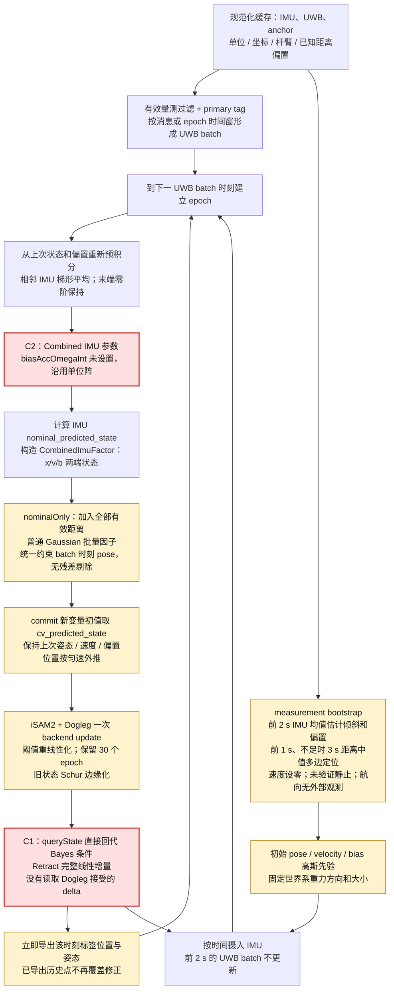
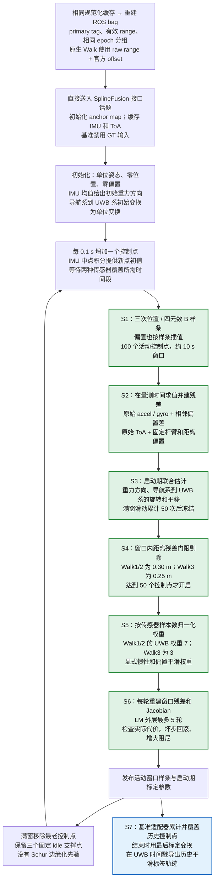

# 无 FDE 主线与 SFUISE：代码流程及精度差距分析

分析日期：2026-10-08。依据：[精度与耗时报告](uwb_imu_accuracy_timing_report.md)、[逐序列指标](sequence_metrics.csv)、当前工作区代码，以及相邻目录中固定在 `75bf5a32f1a8e5c3046a5bd1a1ddf659fa996f7d` 的 SFUISE 源码。分析时 SFUISE 工作树干净；我们的工作树已有未提交改动，本次只新增本文档，没有修改算法或重跑全量基准。

## 1. 先回答：同为紧耦合，为什么差这么多？

**“紧耦合”只说明把距离量测直接纳入惯性状态估计，不能保证两个系统有相同的状态表示、噪声模型、优化质量、异常值处理和输出时延。** 本次差距主要涉及三个层面：

1. **我们的主线存在值得优先修正的实现问题。** 后端选择了 Dogleg，但发布状态时直接回代高斯条件分布，使用的是完整线性最小二乘增量，未使用 Dogleg 接受的增量；该状态还反馈到下一次 IMU 预积分。另一个问题是 `CombinedImuFactor` 的偏置初始协方差沿用单位阵默认值，显著放松了惯性约束。这些问题比“是否换成样条”更应优先排查。
2. **SFUISE 在 Walk 数据上有适合该任务的处理。** 约 10 s 的连续时间样条窗口、窗口内原始 IMU 残差反复优化、启动期重力方向与导航系到 UWB 系变换联合估计、偏置平滑和距离残差剔除，有利于抑制噪声及尖峰。
3. **报告比较的输出并不完全对称。** 我们记录每个 UWB 时刻即时提交的状态；SFUISE 的适配器在运行结束时导出被后续窗口覆盖修正的历史样条，并使用最后收到的标定变换。相同的评价时间戳、标签点和世界坐标系，并不意味着相同的信息截止时间。SFUISE 的结果具有历史平滑优势。

其中，代码行为和两个小型数值诊断可以确认；**每一项对报告精度差距的具体贡献尚未由消融实验分离**，不能把全部差距归因于某一种算法架构。

## 2. 报告究竟显示了什么

### 2.1 最适合分析的比较是原生三条 Walk

| 指标 | current nominal | SFUISE | 解读 |
|---|---:|---:|---|
| 三条 Walk 序列等权 APE RMSE | 0.5916 m | 0.1435 m | current 约为 SFUISE 的 4.12 倍 |
| Walk1：RMSE / median / max | 1.0575 / 0.1623 / 18.5445 m | 0.1572 / 0.1200 / 0.3637 m | 主要差别包括严重尖峰，并非始终差一个数量级 |
| Walk2：RMSE / median / max | 0.2414 / 0.1644 / 1.0302 m | 0.1226 / 0.1101 / 0.2094 m | 常态误差也有差距 |
| Walk3：RMSE / median / max | 0.4760 / 0.1712 / 8.4315 m | 0.1509 / 0.1408 / 0.2565 m | 尖峰再次拉大 RMSE |

进一步只读统计现有 `results/benchmark/evaluation/samples/SFUISE__*__current.json`，没有删点或改变主指标：

| 序列 | APE > 1 m 的评价点 | 占所有平方误差的比例 | 最大 APE 所在缓存时间 |
|---|---:|---:|---:|
| Walk1 | 10 / 570，约 1.75% | 95.04% | 20.9 s |
| Walk2 | 1 / 740，约 0.14% | 2.46% | 61.7 s |
| Walk3 | 6 / 794，约 0.76% | 75.91% | 9.5 s |

现有 `states.csv` 中，Walk1、Walk3 的估计速度模长最大值分别约为 **662.31 m/s、170.37 m/s**。这是行走序列上很强的数值异常信号。它支持优先排查求解和状态查询，但仅凭这些统计无法确定是哪条距离量测或哪一步优化触发了尖峰。

### 2.2 不能推广成“SFUISE 在所有数据上更准确”

- 仿真 raw-frame APE：current **0.0991 m**，SFUISE **0.2837 m**；SE(3) 对齐后分别为 **0.0989 m、0.0840 m**，SFUISE 的 raw-frame 误差包含明显固定变换成分。
- STAR-Loc：current 等权 APE **1.1524 m**，SFUISE 使用 Walk1 默认算法参数时明显发散。
- MILUV：SFUISE 三条均以 `-11` 退出，不能形成正常精度对照。
- HUEC：current 有求解失败及末段严重发散；SFUISE 也有失败和发散，不能把它视为稳定真值替代。
- 三条 Walk 的姿态 APE，SFUISE 约 **163–178°**，current 约 **102–105°**；SFUISE 的位置优势不能直接解释为“绝对姿态也更准确”。大角度姿态误差还需要审计 tracker/body 固定旋转、初始航向和姿态可观性。

报告中的 coverage 是共同可插值评价区间内的比例，不证明输出实时可用，也不证明数值正常。`SUCCESS` 表示运行成功，不等于轨迹精度合格。

## 3. 比较对象与共同的紧耦合部分

我们的对象是报告实际调用的：

`tools/run_dataset_benchmark.py → apps/nominal_dataset_runner.cpp → IncrementalUwbImuEstimator`

它读取由 `config/fde_off.yaml` 生成的有效配置，调用 `prepareEpoch(..., nominalOnly())` 和 `nominalPlan()`；不构造 FDE、PL、异常隔离候选或恢复桥因子。主表只使用 primary tag。**不要把旧版 archive 实现、独立 UWB 定位器、或实时节点的完整完整性流程当作这次 current 的算法路径。**

两者的 ToA 距离模型本质一致：

\[
p_{tag}(t)=p_{body}(t)+R(t)\ell,\qquad
r_d(t)=\|p_{tag}(t)-a_i\|-d_i.
\]

我们的 `UwbPoseBatchFactor` 用 body pose 和逐测量杆臂直接产生距离残差，IMU 因子同时约束 pose、velocity、bias。SFUISE 在导航系中表示轨迹，先通过在线估计的固定变换映射到 UWB 系：

\[
r_d(t)=\|R_{UW}(p_W(t)+R_{WB}(t)\ell)+t_{UW}-a_i\|
       -d_{raw,i}-c_i.
\]

其中 `c_i` 是配置中的固定距离偏置，单位为米。current 在缓存准备阶段已经计算 `d_i=d_raw,i+c_i`；SFUISE 输入 raw range，由其残差减去同一偏置。**SFUISE 不是因为独享 ToA offset 或杆臂补偿而获胜。** 本基准走绝对 ToA，不走其 TDoA 分支。

证据：[nominal 入口](../../apps/nominal_dataset_runner.cpp)、[事务选项与选择计划](../../include/uwb_imu_pl/estimation/epoch_transaction.hpp)、[我们的距离因子](../../src/uwb_imu_pl/factors/realtime_factors.cpp)、[缓存准备](../../tools/run_dataset_benchmark.py)、[SFUISE 距离与 IMU 残差](../../../SFUISE/sfuise/include/Residuals.h)。

## 4. 我们无 FDE 主线的流程图

红色 `C1/C2` 是优先审计的实现问题；黄色是与 SFUISE 存在差异、可能影响精度的环节。图中只画实际 nominal 路径。



### 4.1 实际状态、时间窗和优化设置

- 每个 UWB epoch 的未知量是 `x_k=(R_k,p_k)`、`v_k`、`b_k=(b_a,b_g)`，共 15 维。
- `fixed_lag_epochs=30` 表示 **30 个逻辑 epoch**，不是 30 s；后端写入的时间戳是 epoch 编号，lag 为 29。根据现有三条 Walk 缓存，连续 30 个有效 UWB 消息的时间跨度中位数约 **1.865–1.869 s**。
- `relinearize_threshold=0.1`、`relinearize_skip=1`，启用部分重线性化检查。`skip=1` 是每次检查条件，不是每次把窗口所有因子完全重线性化并迭代到收敛。
- 每次 nominal commit 执行一次 backend update，之后查询状态和边缘协方差；没有显式多轮非线性收敛循环。
- IMU 预积分预测确实算了，但 `commitEpochImpl()` 插入新变量用的是 **CV 预测**。因此不能把“计算了 IMU prediction”画成“求解器使用它作为新状态初值”。这可能增加初值到最优状态的距离，影响短窗口、少迭代和快速运动场景；贡献仍需实验验证。
- batch 内每条距离保留时间戳，但 `UwbPoseBatchFactor::evaluateError()` 只取统一的 batch pose。该误差来自把批内测量同时化；原生 Walk 多距离消息本身共用一个时间戳，不能把它列为 Walk 差距的已证实主因。

证据：[`incremental_estimator.cpp`](../../src/uwb_imu_pl/estimation/incremental_estimator.cpp)，构造函数约 670 行、`backendUpdate()` 约 748 行、`prepareTransaction()` 约 1007 行、`commitEpochImpl()` 约 2825 行；[FDE off 配置](../../config/fde_off.yaml)。

## 5. SFUISE 实际基准路径的流程图

绿色 `S1–S6` 标出在 Walk 上值得借鉴的设计；蓝色 `S7` 是评价输出优势，需要单独控制，不能计作同等实时条件下的算法胜出。



这里的“启动期 50 次”是 **`window_count` 达到 50**：它主要在窗口达到 100 个控制点后递增，并非从第一个小窗口起总共优化 50 次。按 10 Hz 控制点，启动标定持续时间约为窗口填满时间再加 5 s，实际取决于数据供给。

`reject_uwb_window_width=0.5` 在代码里表示启用门限所需的控制点数量比例：`0.5 × window_size=50`。**它不是 0.5 s 移动统计窗口。** `Linearizer` 对当前迭代中 `abs(residual)>threshold` 的距离跳过，不是完备的统计 FDE，也不是自动估计 NLOS bias。

证据：[SFUISE 主循环与优化](../../../SFUISE/sfuise/src/SplineFusion.cpp)、[样条状态](../../../SFUISE/sfuise/include/SplineState.h)、[线性化与权重](../../../SFUISE/sfuise/include/Linearizer.h)、[Walk1 配置](../../../SFUISE/sfuise/config/config_test_isas-walk1.yaml)、[Walk3 配置](../../../SFUISE/sfuise/config/config_test_isas-walk3.yaml)、[本仓库 SFUISE 运行器](../../tools/run_sfuise_benchmark.py)、[轨迹导出适配器](../../benchmark/sfuise_adapter_ros/src/sfuise_trajectory_adapter.cpp)。

## 6. 哪些地方 SFUISE 做得更好，哪些是我们的实现问题

| 标记 | 具体差异 | 对精度的机制 | 结论边界 |
|---|---|---|---|
| C1 / S6 | 我们发布状态用完整线性回代；SFUISE 使用有实际代价检查的 LM 更新 | 我们可能把后端未接受的大步发布并反馈到传播；SFUISE 会回滚坏步 | 已确认查询语义不一致；对各序列 RMSE 的贡献需回放验证 |
| C2 / S2、S5 | 我们未显式设置 `biasAccOmegaInt`；SFUISE 显式构造原始 IMU 与偏置差残差权重 | 默认单位阵显著增大我们的预积分旋转/速度协方差，使姿态及运动状态容易被距离约束拉动 | 已用当地 GTSAM 数值验证；不能只看小 sigma 就断言过度信任 IMU |
| S1 | SFUISE 约 10 s 样条窗口；我们约 1.87 s 的 30-epoch Walk 窗口 | 更多时间跨度有利于估计偏置、运动趋势和弱可观方向；共享控制点提供轨迹平滑 | 条件优势；复杂或快速运动可能产生样条欠拟合 |
| S2 | SFUISE 在量测时刻拟合原始 IMU，窗口重优化时重算模型；我们保存区间预积分量及偏置一阶修正 | 大状态/偏置变化时，原始量测重新线性化有更多修正空间；减少统一时间近似 | 预积分本身是合理紧耦合方法；不能据此断言必然低精度 |
| S3 | SFUISE 启动期估计重力方向与导航系到 UWB 系变换；我们固定世界重力、依赖一次 bootstrap | 允许后续运动量测修正启动误差与坐标关系，缓解一次静止假设失效 | 不是在线估计 IMU-body 外参、杆臂、时延或每个 anchor 距离偏置 |
| S4 | SFUISE 有 0.25/0.30 m 距离门限；current 所有有效距离进入普通最小二乘 | 避免大残差直接影响位姿与偏置；尤其可能降低尾部错误 | 基准边界不对称；误初始化或系统偏差也可能令门限拒绝正确数据 |
| S5 | SFUISE 按窗口内各类样本数归一化，Walk 配置有独立 UWB 与偏置权重；我们使用固定概率噪声参数 | 两种传感器相对权重和偏置变化速度不同；SFUISE 对原生 Walk 更适配 | 它的经验权重不能直接当作与 GTSAM 同单位的传感器噪声密度 |
| S6 | SFUISE 每次最多 5 轮窗口 LM；我们每 epoch 一次 iSAM2 更新，使用 CV 初值 | 多轮重线性化与接受/回滚可改善非线性局部解和初始化后的恢复 | 我们已有 Dogleg，不能写成“我们纯 GN、SFUISE 才有稳健求解器” |
| S7 | SFUISE 导出后续窗口修正的历史；我们导出即时当前状态 | 使用未来量测修正较早时刻、降低历史轨迹误差 | 是信息截止时间优势；需按同一输出延迟重评后再比较 |

### 6.1 C1：配置了 Dogleg，为什么仍可能出现大步？

我们的 [`queryState()`](../../src/uwb_imu_pl/estimation/incremental_estimator.cpp) 在约 2639 行：

```cpp
local_delta.insert(bayes_net[i - 1]->solve(local_delta));
pose = Retract(theta_pose, local_delta_pose);
```

这是在当前线性化点求高斯系统完整解。GTSAM 的 Dogleg 则在内部先算 Newton 增量，再结合梯度方向、信赖域和非线性代价选择接受增量；`calculateEstimate()` 使用的是该接受增量。**完整线性系统解的“精确”，不等于非线性 Dogleg 当前状态的“正确”。**

当地 GTSAM 源码证据：[`ISAM2::updateDelta()` 与 `calculateEstimate()`](/home/mint/dep/gtsam/gtsam/nonlinear/ISAM2.cpp:701)。该文件约 727 行计算 `deltaNewton_`，约 743 行选择 Dogleg 步，约 753 行将接受步写入 `delta_`，约 765 行读取 `getDelta()` 并 retract。

使用与项目相同的 `/usr/local/lib/libgtsam.so`，对简单残差 `r(x)=x²−1`、初值 `x=0.01` 做独立诊断：

| 状态查询方式 | 得到的 x | 平方残差 |
|---|---:|---:|
| 条件分布完整回代再 retract | 50.005 | 6,247,500.375 |
| `ISAM2::calculateEstimate<double>()`，Dogleg | 0.76 | 0.178422 |

诊断证明这两种查询不是等价替换，并不证明 Walk 的每个尖峰都由 C1 触发。我们的 `current_state_` 被用于下个区间的 pose、velocity、bias 和 IMU prediction，因此这里的问题可能沿反馈链放大。应先验证发布均值与后端接受解的一致性，不能仅调整重线性化阈值或给距离加门限掩盖它。

### 6.2 C2：真正的 IMU 权重由完整协方差决定

[`fde_off.yaml`](../../config/fde_off.yaml) 中加速度 sigma 约 `7.071e−4`，陀螺 sigma 约 `7.071e−5`，源于[配置生成器](../../tools/generate_fde_profile_configs.py)保留历史仿真参数的转换。代码把它们平方后写入 GTSAM 连续时间噪声协方差；这并不是针对 Waveshare、PX4、Livox 等设备统一完成的实测标定。

但更关键的是：构造预积分参数时没有设置 `biasAccOmegaInt`。当地 GTSAM [`CombinedImuFactor.h`](/usr/local/include/gtsam/navigation/CombinedImuFactor.h:61) 默认值是 **`I₆`**；[`CombinedImuFactor.cpp`](/home/mint/dep/gtsam/gtsam/navigation/CombinedImuFactor.cpp:132) 将其相关块加进旋转、速度过程协方差。它不同于我们已设置的偏置随机游走协方差，也不同于状态 `b_0` 的先验。

独立预积分诊断：使用现有 sigma/RW 参数，200 Hz 静止 IMU 积分 0.1 s：

| 参数情形 | yaw 方向预积分标准差 | z 速度预积分标准差 |
|---|---:|---:|
| 当前默认 `biasAccOmegaInt=I₆` | 0.316228 rad，约 18.12° | 0.316228 m/s |
| 只为分离机制，将该项置零 | 2.243e−5 rad | 2.243e−4 m/s |

**置零是诊断对照，不是建议不经标定就上线的配置。** 这个结果说明默认项可以压过 YAML 中很小的 IMU 噪声项。实际可能出现“惯性约束很松、状态仍有紧偏置连续性约束”的组合，使距离残差通过姿态/速度被吸收。

SFUISE 直接使用原始 IMU 残差，避免了该特定默认参数问题，但其经验权重仍然需要验证。应先明确 sigma 的连续时间/离散时间语义、偏置初始不确定度和完整 `preintMeasCov()`，再讨论哪个系统更信任 IMU。

### 6.3 S1/S2：连续时间样条究竟提供什么

SFUISE 的位置、姿态、偏置由低频共享控制点表示。位置一阶导数提供速度，二阶导数提供加速度；姿态导数提供角速度。以其使用的向上重力补偿向量 `g` 表示，IMU 残差为：

\[
r_a(t)=R(t)^T(\ddot p(t)+g)-a_m(t)+b_a(t),\qquad
r_\omega(t)=\omega_{spline}(t)-\omega_m(t)+b_g(t).
\]

距离残差和惯性残差会共同修改支撑同一时间段的控制点。偏置也连续插值，并由相邻 IMU 时间处的偏置差约束。这有利于输出连续、平滑的轨迹。

我们的姿态、位置、速度和偏置是独立 epoch 状态，通过预积分因子连接，保留状态的修改仍然可以由因子图传播；**我们同样有滑窗平滑能力**。差异是窗口时间跨度、状态自由度、输出是否回写历史，以及保留的预积分通常只进行偏置一阶修正，nominal 路径没有因历史偏置变化而重新积分所有旧原始 IMU。

SFUISE 的窗口移除只是把最老点转为三个固定 idle 支撑点之一，未实现我们固定 lag 的 Schur 信息先验。因而不能写成“SFUISE 使用了更高级的边缘化”。我们在历史信息保存上反而有更完整的机制。

### 6.4 S3/S5：初始化、可观性和相对权重

current bootstrap 用前 2 s IMU 均值当作静止信息，没有静止检测；初速度设零，航向没有观测约束。随后姿态先验 sigma 是 `0.1 rad`，bias accel/gyro 的先验 sigma 分别为 `0.1 m/s²` 和 `0.01 rad/s`。启动期存在真实运动时，平均角速度可能被误作 gyro bias，平均加速度也可能被误作倾斜或 accel bias。

SFUISE 的初始位置为零，不能说其初值天然更准确；它的优势是随后联合优化重力方向和 `q_nav_uwb/t_nav_uwb`。这相当于允许算法从运动及距离中逐步校正导航系关系，而不是靠一次 bootstrap 冻结所有关系。该变换属于算法状态，不是用 GT 做在线对齐；本基准中 `topic_ground_truth=/NO_GT`。

两个系统都固定 tag 杆臂和已知距离偏置。SFUISE 没有在本路径中优化 IMU 到 body 旋转、IMU/UWB 时延或逐 anchor 的在线距离偏置，也没有额外 GT 姿态约束。

SFUISE 的典型目标结构是：

\[
E_U=\frac{w_U^2}{N_U}\sum_{i\in accepted}r_{d,i}^2,\qquad
E_a=\frac{1}{N_I}\sum_i r_{a,i}^T\operatorname{diag}((w_a c_a)^2)r_{a,i},
\]

陀螺项类似，偏置差项除以 `N_I−1`。`accel_var_inv` 等配置值在代码中还会平方，名称本身不足以说明其与我们 sigma 的等价关系。窗口样本数归一化会改变传感器数量、采样率变化时的相对影响，但它是经验目标函数设计，不等价于完成概率噪声校准。

### 6.5 S7：相同评价时间戳，仍可能使用不同的未来信息

current 的入口在每次 commit 后立即写一行 `trajectory.tum`，之后没有重写该行。SFUISE 适配器则：

1. 每次收到窗口结果，调用 `global_.updateKnots(&local)` 覆盖已存在的历史控制点。
2. 收到标定消息时更新全局变换缓存。
3. 结束时调用 `WriteOutputs()`，用累计样条和最后的标定变换，在保存的 ToA 时间戳求值。

因此，SFUISE 较早时间的轨迹通常被之后的窗口重新优化；启动期较早点还会被后来的标定变换重新投影。其未来信息跨度与控制点支撑、窗口滑动有关，约为窗口量级，不能直接给每个点统一扣一个固定 10 s。

要公平比较，可以同时发布两套指标：**同一信息截止时刻的在线当前状态**，以及**同一允许输出延迟的固定滞后历史状态**。把 current 的最终历史状态导出后与当前 SFUISE 导出比较，也可以帮助分离平滑输出带来的收益；但仍要控制各自窗口和最终标定可用时间。

## 7. 还有一个独立问题：direct nominal 不等于实时 fde=off

报告仿真等价性检查失败：位置最大差 **0.2925 m**，姿态最大差 **179.96°**，两侧各 2421 点。这意味着本文的 current 结论应首先归属于 direct runner，不能直接推成实时节点已经复现的结果。

当前代码中可见一个明确的接口差异：[等价性脚本](../../tools/check_sim_realtime_equivalence.py)读取了 bootstrap，但只把位置和速度写进实时配置；[实时节点首次初始化](../../tools/run_realtime_integrity.cpp)在没有 `seed_state` 时使用 `NavigationState` 默认单位姿态和零偏置。direct runner 则将 bootstrap 姿态和两类偏置一并传给 estimator。双方初始化并没有通过该脚本完全统一。

这能解释为什么该检查目前不能作为“相同算法、相同输入与初值”的证明，**尚不能说明全部 179.96° 差异只由初始化造成**。修复后还应检查 IMU 边界、量测协方差、杆臂、epoch 分组及 C1 的影响。

RPE 也要谨慎解释：[评价器](../../tools/benchmark_common.py)的平移 RPE 是分别用估计/GT 在起点的姿态，把 1 s 位移转进各自局部坐标系后比较。因此“仿真 APE 只有 0.0991 m，但平移 RPE 有 1.1426 m”并不自相矛盾，大的姿态误差会进入该指标。应补看世界系位移差，区分位置运动误差和姿态/坐标定义问题；同时保留当前标准局部 RPE。

## 8. 建议按这个顺序缩小差距

| 优先级 | 下一步 | 要回答的问题 |
|---|---|---|
| P0 | 将发布状态查询与 iSAM2 Dogleg 接受解对照，检查一致性并修正 C1；保留状态查询耗时测量 | 先解决错误的大步输出/反馈，Walk1/3 尖峰是否显著减少？ |
| P0 | 显式校准预积分偏置初始协方差及完整协方差，验证 C2；同步审计单位和采样率 | 姿态、速度是否被过松惯性约束拉动？避免盲目放大或缩小 sigma |
| P0 | 统一 direct/ROS 的姿态、偏置、位置、速度和起始时间；重新做等价性检查 | 修正后的主线是否可以在实时入口复现？ |
| P0 | 比较同一输出延迟的轨迹，并补齐姿态固定旋转审计 | 目前的 SFUISE 位置优势有多少来自历史平滑及输出口径？ |
| P1 | nominal 使用 IMU prediction 作为新变量初值，增加有限额外迭代并检查代价/增量 | 是否降低非线性初值误差和局部失败？ |
| P1 | 用秒定义或控制有效滑窗长度，比较约 2 s 与约 10 s；按设备标定 IMU 噪声和 RW | 长窗及更合理惯性权重是否改善常态精度和 bias 稳定性？ |
| P1 | 静止检测/动态初始化，放宽无观测航向先验，必要时估计重力或导航系变换 | 是否减少 bootstrap 对运动段的误解释？ |
| P1 | SFUISE 门限关闭/开启成对跑；current 若加入同门限或鲁棒损失，另命名报告 | 原始无剔除主线差距与异常处理收益分别是多少？不要覆盖原 nominal 定义 |
| P2 | 评估批内逐测量时间建模或样条前端，保留现有预积分作为对照 | 实现问题排除后，连续时间表示还有多少独立收益？ |

建议先做仿真和三条 Walk 的小规模消融，再评估 HUEC、STAR-Loc 的泛化。每项仅改变一个因素，记录 raw/aligned APE、median/P95/max、姿态误差、速度峰值、失败率、输出延迟和耗时；不把失败、尖峰点或被门限丢弃的距离隐藏起来。

**不能凭现有结果建议直接重写为 SFUISE。** 先修均值查询和噪声模型、统一比较口径，再决定是否值得引入长窗样条。预积分因子图也能够达到高精度，当前差距不是“离散紧耦合一定不如连续紧耦合”的证明。

## 附录：两个独立诊断的可复现代码

这些是本次新运行的机制诊断，不是新基准结果。测试文件临时存放在 `/tmp/uwb_sfuise_flow_audit/`；以下代码使文档在临时文件清理后仍可复现。

### A. Dogleg 状态与完整回代不等价

保存为 `/tmp/dogleg_probe.cpp`：

```cpp
#include <gtsam/nonlinear/ISAM2.h>
#include <gtsam/nonlinear/NonlinearFactor.h>
#include <gtsam/linear/NoiseModel.h>
#include <iostream>
#include <iomanip>
class SquareFactor : public gtsam::NoiseModelFactor1<double> {
 public:
  SquareFactor() : NoiseModelFactor1(
      gtsam::noiseModel::Isotropic::Sigma(1, 1.0), 0) {}
  gtsam::Vector evaluateError(const double& x,
      boost::optional<gtsam::Matrix&> H = boost::none) const override {
    if (H) *H = gtsam::Matrix::Constant(1, 1, 2*x);
    return gtsam::Vector1(x*x-1);
  }
};
int main() {
  gtsam::ISAM2Params p;
  p.optimizationParams = gtsam::ISAM2DoglegParams();
  gtsam::ISAM2 s(p);
  gtsam::NonlinearFactorGraph g;
  g.add(boost::make_shared<SquareFactor>());
  gtsam::Values v;
  v.insert(0, 0.01);
  s.update(g, v);
  const double theta = s.getLinearizationPoint().at<double>(0);
  const double direct = theta + s.clique(0)->conditional()
      ->solve(gtsam::VectorValues()).at(0)(0);
  const double accepted = s.calculateEstimate<double>(0);
  std::cout << std::setprecision(15) << "direct=" << direct
            << " dogleg=" << accepted << '\n';
}
```

```bash
c++ -std=c++17 -O3 -DNDEBUG -march=native \
  -I/usr/local/include -I/usr/include/eigen3 /tmp/dogleg_probe.cpp \
  -L/usr/local/lib -Wl,-rpath,/usr/local/lib -lgtsam -ltbb \
  -o /tmp/dogleg_probe
/tmp/dogleg_probe
```

实测输出：`direct=50.005 dogleg=0.76`。编译选项使用本机项目相同的 `-march=native` 和头文件/库路径，保持 Eigen 编译条件一致。

### B. 预积分默认偏置协方差的影响

保存为 `/tmp/covariance_probe.cpp`，用上面相同编译参数替换文件名：

```cpp
#include <gtsam/navigation/CombinedImuFactor.h>
#include <iostream>
#include <iomanip>
#include <cmath>
int main() {
  for (bool clear : {false, true}) {
    auto p = gtsam::PreintegratedCombinedMeasurements::Params
        ::MakeSharedU(9.80665);
    p->accelerometerCovariance = gtsam::I_3x3 * 5e-7;
    p->gyroscopeCovariance = gtsam::I_3x3 * 5e-9;
    p->biasAccCovariance = gtsam::I_3x3 * 1e-6;
    p->biasOmegaCovariance = gtsam::I_3x3 * 1e-8;
    p->integrationCovariance = gtsam::I_3x3 * 1e-9;
    if (clear) p->biasAccOmegaInt.setZero();
    gtsam::PreintegratedCombinedMeasurements m(
        p, gtsam::imuBias::ConstantBias());
    for (int i = 0; i < 20; ++i)
      m.integrateMeasurement(gtsam::Vector3(0,0,9.80665),
                             gtsam::Vector3::Zero(), 0.005);
    auto cov = m.preintMeasCov();
    std::cout << std::setprecision(12)
              << "biasAccOmegaInt=" << (clear ? "0" : "I")
              << " rot_sigma_rad=" << std::sqrt(cov(2,2))
              << " vz_sigma_mps=" << std::sqrt(cov(8,8)) << '\n';
  }
}
```

实测输出：

```text
biasAccOmegaInt=I rot_sigma_rad=0.316227766812 vz_sigma_mps=0.316227845562
biasAccOmegaInt=0 rot_sigma_rad=2.24296121233e-05 vz_sigma_mps=0.000224296121233
```
