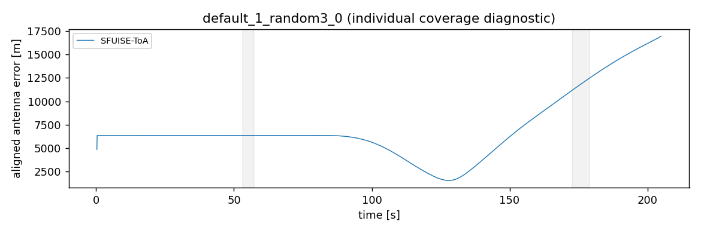
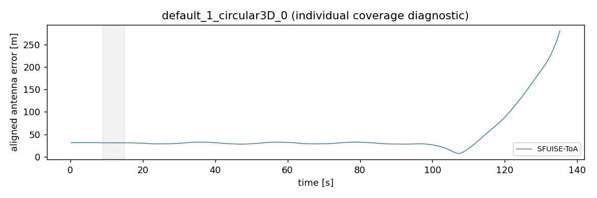

# MILUV Recover vs Reject development 预实验

仅已审计合格的 default_1_random3_0、default_1_circular3D_0；ifo001/tag10、全部6 anchors、完整录制。
原始 range_raw 与 PX4 IMU，作者公开杆臂 [0.13189,-0.17245,-0.05249] m，沿用作者 body/IMU 共点近似。未进行GT初始化、IMU去偏、时间拟合或静态测距校正；总正误差不是已分离的动态NLOS。
冻结PL双向CUSUM与LCB参数，不按结果调整；每条一个producer，RR读取同一Stage2 cache。Cauchy scale=2.3849；SFUISE为原生独立系统参考，ToA offset明确置零。
10 Hz完整UWB区间；估计最近邻≤0.02s、GT bracket≤0.05s、不外推。天线参考点、scale=1 SE3。RR在共同有效时刻各做一次全区间对齐，窗口不重新对齐；四方法共同覆盖另列。
窗口使用每link全部 e>0.5m、持续≥2s、至少5包、gap≤1s 事件的去重并集，仅evaluator可见。

SUCCESS表示有效格式导出，不等于精度通过。全部距离指标单位m。

本轮两条producer均未发布Stage2 cache，RR四格NOT_RUN；两条Cauchy均达到LM迭代上限。SFUISE两条虽导出，但轨迹明显发散；独立scipy SE3复核与主指标一致，原始轨迹本身已远超GT运动范围。不能据此判断Recover胜负，也不能认定仅是外参问题。

| recording | method | ATE RMSE | 正误差窗口RMSE | ATE P95 | 覆盖率 | status |
|---|---|---|---|---|---|---|
| default_1_random3_0 | suppress_all | NA | NA | NA | 0.000000 | NOT_RUN |
| default_1_random3_0 | lcb_fixed_full | NA | NA | NA | 0.000000 | NOT_RUN |
| default_1_random3_0 | robust_cauchy | NA | NA | NA | 0.000000 | FAILURE |
| default_1_random3_0 | SFUISE-ToA | 8065.734836 | 9971.821814 | 15415.261476 | 0.780000 | SUCCESS |
| default_1_circular3D_0 | suppress_all | NA | NA | NA | 0.000000 | NOT_RUN |
| default_1_circular3D_0 | lcb_fixed_full | NA | NA | NA | 0.000000 | NOT_RUN |
| default_1_circular3D_0 | robust_cauchy | NA | NA | NA | 0.000000 | FAILURE |
| default_1_circular3D_0 | SFUISE-ToA | 67.807775 | 31.224642 | 177.533821 | 0.772021 | SUCCESS |

range before=z_raw−h_GT；after=z_raw−delta_final−h_GT，仅应用最终实际恢复offset。suppressed/fallback保留原始range；Cauchy/SF列是相同planned观测的测量诊断，不是其post-fit残差。

| recording | method | range n | before | after | 候选观测 | 候选段 | decision接受段 | final接受段 | fallback |
|---|---|---|---|---|---|---|---|---|---|
| default_1_random3_0 | suppress_all | NA | NA | NA | NA | NA | NA | NA | NA |
| default_1_random3_0 | lcb_fixed_full | NA | NA | NA | NA | NA | NA | NA | NA |
| default_1_random3_0 | robust_cauchy | NA | NA | NA | NA | NA | NA | NA | NA |
| default_1_random3_0 | SFUISE-ToA | 1820 | 0.330640 | 0.330640 | NA | NA | NA | NA | False |
| default_1_circular3D_0 | suppress_all | NA | NA | NA | NA | NA | NA | NA | NA |
| default_1_circular3D_0 | lcb_fixed_full | NA | NA | NA | NA | NA | NA | NA | NA |
| default_1_circular3D_0 | robust_cauchy | NA | NA | NA | NA | NA | NA | NA | NA |
| default_1_circular3D_0 | SFUISE-ToA | 1189 | 0.353793 | 0.353793 | NA | NA | NA | NA | False |

| recording | method | 恢复子集n | 子集before | 子集after |
|---|---|---|---|---|
| default_1_random3_0 | suppress_all | NA | NA | NA |
| default_1_random3_0 | lcb_fixed_full | NA | NA | NA |
| default_1_random3_0 | robust_cauchy | NA | NA | NA |
| default_1_random3_0 | SFUISE-ToA | 0 | NA | NA |
| default_1_circular3D_0 | suppress_all | NA | NA | NA |
| default_1_circular3D_0 | lcb_fixed_full | NA | NA | NA |
| default_1_circular3D_0 | robust_cauchy | NA | NA | NA |
| default_1_circular3D_0 | SFUISE-ToA | 0 | NA | NA |

上表依赖方法未运行时，Stage2/recovery计数为NA。下面单列Stage1已有证据：有效空support可为0，但不代表已成功发布Stage2或运行LCB。

| recording | detector有效 | 候选观测 | 候选段 |
|---|---|---|---|
| default_1_random3_0 | False | NA | NA |
| default_1_circular3D_0 | True | 0 | 0 |

差值为 Recover−Reject，正值表示Recover更差；缺失NA，fallback不计为成功恢复收益。

| recording | delta_RR | delta_RR_NLOS | 共同样本 | 解释 |
|---|---|---|---|---|
| default_1_random3_0 | NA | NA | 0 | NA |
| default_1_circular3D_0 | NA | NA | 0 | NA |

科学进程启动 6/10，逐条串行，每树1800秒；无算法重试。producer失败时两个依赖方法NOT_RUN，独立方法继续。

| recording | task | status | exit | 原因 |
|---|---|---|---|---|
| default_1_random3_0 | producer | FAILURE | 1 | Indeterminant linear system detected while working near variable 8646911284551352564 (Symbol: x244). Thrown when a linear system is ill-posed. The most common cause for this error is having underconstrained variables. Mathematically, the system is underdetermined. See the GTSAM Doxygen documentation at http://borg.cc.gatech.edu/ on gtsam::IndeterminantLinearSystemException for more information. |
| default_1_random3_0 | suppress_all | NOT_RUN | NA | PRODUCER_FAILED |
| default_1_random3_0 | lcb_fixed_full | NOT_RUN | NA | PRODUCER_FAILED |
| default_1_random3_0 | robust_cauchy | FAILURE | 1 | PRELIMINARY_LM_FAILED:CONDITIONAL_LM_MAX_ITERATIONS |
| default_1_random3_0 | SFUISE-ToA | SUCCESS | 0 | NA |
| default_1_circular3D_0 | producer | FAILURE | 1 | PL_RAW_REFERENCE_FAILED:CONDITIONAL_LM_MAX_ITERATIONS |
| default_1_circular3D_0 | suppress_all | NOT_RUN | NA | PRODUCER_FAILED |
| default_1_circular3D_0 | lcb_fixed_full | NOT_RUN | NA | PRODUCER_FAILED |
| default_1_circular3D_0 | robust_cauchy | FAILURE | 1 | PRELIMINARY_LM_FAILED:CONDITIONAL_LM_MAX_ITERATIONS |
| default_1_circular3D_0 | SFUISE-ToA | SUCCESS | 0 | NA |

26项工程测试通过（20项共同输入/评价/记账、3项MILUV、3项准入及final-mask/fallback）；两条C++ prepare-only与Cauchy共同初值、完整CSV→ROS往返、SFUISE无测量启动检查见preflight。科学成功与否以上表为准。
random3 producer在x244（约27.80s）报告线性系统不定，局部IMU bracket约4ms；circular3D detector完成有效空support，但PL_RAW_REFERENCE达到LM上限。没有因此放宽求解判据或重跑参数；根因尚未唯一识别。
GT变化不改变测量白名单cache；原始GT、窗口及其他方法产物未挂载给估计器。冻结实现、核心、源输入、准备产物均有hash；实际RR配对额外核验input plan、nominal sigma、原始Values、共同准备身份、support和Stage2 Values。

[逐方法CSV](evidence/miluv-recover-vs-reject-20260912A/metrics.csv)、[配对CSV](evidence/miluv-recover-vs-reject-20260912A/paired_differences.csv)、[四方法共同覆盖](evidence/miluv-recover-vs-reject-20260912A/four_method_common.csv)、[配对身份](evidence/miluv-recover-vs-reject-20260912A/pairing_checks.json)、[全事件统计](evidence/miluv-recover-vs-reject-20260912A/evaluator_audit.csv)。
[锁定manifest](evidence/miluv-recover-vs-reject-20260912A/lock.json)、[实际命令、退出码与产物hash](evidence/miluv-recover-vs-reject-20260912A/execution.json)、[工程准入](evidence/miluv-recover-vs-reject-20260912A/preflight.json)。
完整独立输出：`/home/mint/ws_fusion_uwb/src/uwb-imu-fusion-ie/experiments/results/miluv-recover-vs-reject-20260912A`；GT私有评价：`/home/mint/ws_fusion_uwb/evaluator_private/icra/miluv_rr/miluv-recover-vs-reject-20260912A`。





SFUISE频率配置40/125仅为冻结元数据；原生sample_coeff=1分支保留每条消息，不按该频率重采样。

复现入口（prepare要求新目录；execute拒绝已有ledger，不能自动重跑科学矩阵）：

```bash
python3 experiments/scripts/run_miluv_recover_vs_reject.py prepare --run /home/mint/ws_fusion_uwb/src/uwb-imu-fusion-ie/experiments/results/miluv-recover-vs-reject-20260912A
python3 experiments/scripts/run_miluv_recover_vs_reject.py preflight --run /home/mint/ws_fusion_uwb/src/uwb-imu-fusion-ie/experiments/results/miluv-recover-vs-reject-20260912A
python3 experiments/scripts/run_miluv_recover_vs_reject.py execute --run /home/mint/ws_fusion_uwb/src/uwb-imu-fusion-ie/experiments/results/miluv-recover-vs-reject-20260912A
python3 experiments/scripts/run_miluv_recover_vs_reject.py evaluate --run /home/mint/ws_fusion_uwb/src/uwb-imu-fusion-ie/experiments/results/miluv-recover-vs-reject-20260912A
python3 experiments/scripts/run_miluv_recover_vs_reject.py verify --run /home/mint/ws_fusion_uwb/src/uwb-imu-fusion-ie/experiments/results/miluv-recover-vs-reject-20260912A
```

[冻结协议](MILUV_RECOVER_VS_REJECT_PROTOCOL.md)。保留STAR-loc全部历史结果；不升级held-out、C1–C3、T10/T11或Recover优越性claim。未提交或push。
