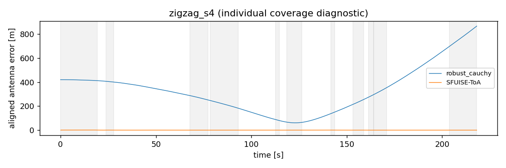
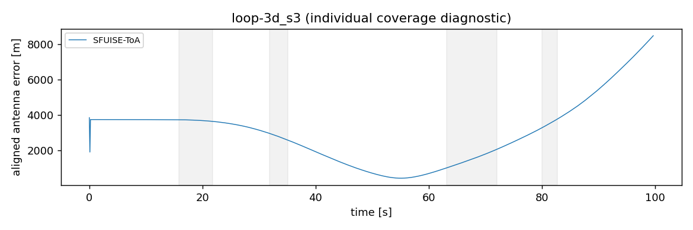
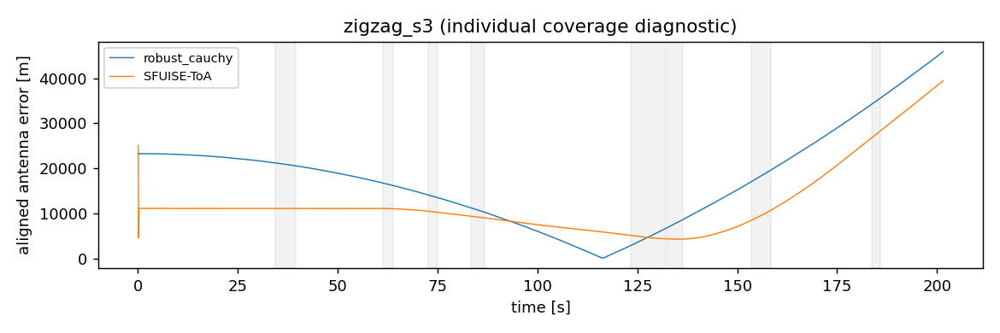

# Recover vs Reject：GT辅助准入 development 预实验

12个方法单元：5正常导出、1失败、6未运行；科学进程9/15。RR差值可用0/3，不能从NA判断Recover胜负。

本轮按冻结三条录制执行并保留全部失败。输入符号/轴变换与固定时钟偏移由现有数据诊断后冻结；估计器只读测量白名单输入。
这是使用本批GT辅助输入解释的development实验；不作为独立标定、held-out或论文主claim。

## 为什么上一轮没能运行，以及本轮解决了什么

上一轮在独立资料不能闭合CSV的IMU语义时按合同阻塞，科学任务为0，不能据此判断Recover失败。
本轮用户授权用现有GT诊断。IMU CSV与UWB CSV携带的同一rig GT位姿证明两套时间轴不一致；只用GT-to-GT位姿拟合一个常量偏移，未用估计轨迹或测距残差优化。
加速度和角速度均采用固定坐标变换 `diag(1,-1,-1)`：翻转y/z，是det=+1的旋转；加速度不整体取负，符合 `f=Rᵀ(a−g)`。IMU时间加下表偏移，UWB源行和时间完全不动。

| recording | IMU→UWB偏移s | 加速度RMS m/s² | 角速度RMS rad/s | rig原点假设RMS | IMU原点假设RMS | 两原点预测差RMS |
|---|---|---|---|---|---|---|
| loop-3d_s3 | 0.789776 | 0.562648 | 0.129978 | 0.536593 | 0.562648 | 0.147717 |
| zigzag_s3 | -1.426310 | 1.112692 | 0.523647 | 1.028520 | 1.112692 | 0.352049 |
| zigzag_s4 | 0.177321 | 0.448617 | 0.021659 | 0.446066 | 0.448617 | 0.037037 |

rig原点假设的加速度RMS略低；仅凭平滑GT二阶导数、传感器噪声和这些运动，不能唯一确定作者是否作过原点转换。
本轮明确采用物理IMU原点近似、rig方向作为body坐标；未从较小残差宣称辨认出实际处理流程。厂商camera–IMU与三条发布camera–rig外参的共同均值只形成近似杆臂，不逐录制优化测距几何。
`lever_body_m=[-0.2005545748111705, -0.26889400885942955, 0.15971868989438356]`；GT参考为作者Vicon tag1天线位置。不能从最终CSV唯一逆推出原始IMU到CSV的完整处理代码。
该原点近似尤其限制快速转动段的解释；原点信号与诊断误差量级均保留。没有拟合传感器bias/噪声/scale，原始range的固定beta未校正。

## 12个方法单元

SUCCESS只表示进程/后端完成有效格式导出，不表示定位精度达标。5条导出轨迹中4条严重发散：Cauchy在两条zigzag上ATE为376.269/20640.156m，SFUISE在loop-3d_s3/zigzag_s3上为3512.804/14494.768m。
已用独立scipy Rotation.align_vectors复核全部5个SE3 RMSE，数值一致；原始导出位置本身已跨越千米至数万米，GT运动范围约6m，因此这些大误差不是对齐公式造成的。它们是保留的负结果，不升级为成功定位。
所有距离指标单位m。RR主指标使用两方法共同有效时刻各自进行一次全区间SE3、scale=1对齐；窗口内不重对齐。
固定10Hz网格覆盖完整UWB首末时刻，估计最近邻≤0.02s、GT bracket≤0.05s，不外推。SFUISE缺失不缩短主RR对照。

| recording | method | ATE RMSE | 正误差窗口RMSE | ATE P95 | 覆盖率 | status |
|---|---|---|---|---|---|---|
| zigzag_s4 | suppress_all | NA | NA | NA | 0.000000 | NOT_RUN |
| zigzag_s4 | lcb_fixed_full | NA | NA | NA | 0.000000 | NOT_RUN |
| zigzag_s4 | robust_cauchy | 376.269171 | 408.153683 | 726.195574 | 0.993584 | SUCCESS |
| zigzag_s4 | SFUISE-ToA | 0.429247 | 0.572332 | 1.069290 | 0.993584 | SUCCESS |
| loop-3d_s3 | suppress_all | NA | NA | NA | 0.000000 | NOT_RUN |
| loop-3d_s3 | lcb_fixed_full | NA | NA | NA | 0.000000 | NOT_RUN |
| loop-3d_s3 | robust_cauchy | NA | NA | NA | 0.000000 | FAILURE |
| loop-3d_s3 | SFUISE-ToA | 3512.803949 | 2794.689225 | 6835.720016 | 0.995992 | SUCCESS |
| zigzag_s3 | suppress_all | NA | NA | NA | 0.000000 | NOT_RUN |
| zigzag_s3 | lcb_fixed_full | NA | NA | NA | 0.000000 | NOT_RUN |
| zigzag_s3 | robust_cauchy | 20640.156012 | 16049.892082 | 39196.169615 | 0.994045 | SUCCESS |
| zigzag_s3 | SFUISE-ToA | 14494.767833 | 10778.101755 | 32266.012637 | 0.994541 | SUCCESS |

| recording | 全部正误差事件 | 去重窗口 | 并集时长s |
|---|---|---|---|
| zigzag_s4 | 14 | 11 | 89.49765490700001 |
| loop-3d_s3 | 4 | 4 | 20.811029865 |
| zigzag_s3 | 12 | 8 | 33.12772561399998 |

窗口是审计 `e>0.5m、持续≥2s、至少5包、gap≤1s` 的逐link全部事件并集，不能等同真实动态NLOS标签。

## 同planned obs_id的range诊断与恢复记账

失败producer的候选计数仅为失败状态快照；特别是valid=false时的0不代表有效空support。未运行的decision/final接受数保持NA，不能据此声称LCB拒绝了全部候选。
`before=z_raw−h_GT`；`after=z_raw−delta_final−h_GT`。只对最终实际恢复观测施加offset；suppressed/fallback观测保持原始range，未伪装成校正。SFUISE/Cauchy没有本方法offset，before/after相同仅表示这一测量诊断。

| recording | method | range n | before | after | 候选观测 | 候选段 | decision接受段 | final接受段 | fallback |
|---|---|---|---|---|---|---|---|---|---|
| zigzag_s4 | suppress_all | NA | NA | NA | NA | NA | NA | NA | NA |
| zigzag_s4 | lcb_fixed_full | NA | NA | NA | NA | NA | NA | NA | NA |
| zigzag_s4 | robust_cauchy | 12453 | 0.331740 | 0.331740 | NA | NA | NA | NA | False |
| zigzag_s4 | SFUISE-ToA | 12453 | 0.331740 | 0.331740 | NA | NA | NA | NA | False |
| loop-3d_s3 | suppress_all | NA | NA | NA | 6 | 2 | NA | NA | NA |
| loop-3d_s3 | lcb_fixed_full | NA | NA | NA | 6 | 2 | NA | NA | NA |
| loop-3d_s3 | robust_cauchy | NA | NA | NA | NA | NA | NA | NA | NA |
| loop-3d_s3 | SFUISE-ToA | 5892 | 0.321205 | 0.321205 | NA | NA | NA | NA | False |
| zigzag_s3 | suppress_all | NA | NA | NA | 0 | 0 | NA | NA | NA |
| zigzag_s3 | lcb_fixed_full | NA | NA | NA | 0 | 0 | NA | NA | NA |
| zigzag_s3 | robust_cauchy | 11843 | 0.282565 | 0.282565 | NA | NA | NA | NA | False |
| zigzag_s3 | SFUISE-ToA | 11843 | 0.282565 | 0.282565 | NA | NA | NA | NA | False |

| recording | method | 恢复子集n | 子集before | 子集after |
|---|---|---|---|---|
| zigzag_s4 | suppress_all | NA | NA | NA |
| zigzag_s4 | lcb_fixed_full | NA | NA | NA |
| zigzag_s4 | robust_cauchy | 0 | NA | NA |
| zigzag_s4 | SFUISE-ToA | 0 | NA | NA |
| loop-3d_s3 | suppress_all | NA | NA | NA |
| loop-3d_s3 | lcb_fixed_full | NA | NA | NA |
| loop-3d_s3 | robust_cauchy | NA | NA | NA |
| loop-3d_s3 | SFUISE-ToA | 0 | NA | NA |
| zigzag_s3 | suppress_all | NA | NA | NA |
| zigzag_s3 | lcb_fixed_full | NA | NA | NA |
| zigzag_s3 | robust_cauchy | 0 | NA | NA |
| zigzag_s3 | SFUISE-ToA | 0 | NA | NA |

## 三条独立配对差值

如果producer未成功发布Stage2 cache，两个依赖方法均不运行，实际共同support/Stage2 Values配对核验不可用；工程拒配测试不能代替实际成功配对。
差值严格为Recover−Reject；正值表示Recover更差。缺失为NA，fallback差值不计作成功恢复收益。

| recording | delta_RR | delta_RR_window | RR共同样本 | 四方法共同样本 | 解释 |
|---|---|---|---|---|---|
| zigzag_s4 | NA | NA | 0 | 0 | NA |
| loop-3d_s3 | NA | NA | 0 | 0 | NA |
| zigzag_s3 | NA | NA | 0 | 0 | NA |

[四方法共同覆盖比较](evidence/recover-vs-reject-gt-20260912C/four_method_common.csv) 单列，不替代RR主表。
[共同input/初值/support/Stage2 Values身份核验](evidence/recover-vs-reject-gt-20260912C/pairing_checks.json)。不可配对者不产生数值差。

## 运行预算、失败与工程验证

科学进程实际启动 9/15；每个进程树限时1800秒，名单顺序串行，不因失败更换录制或调参重试。

zigzag_s4的PL bootstrap使用前5个关键帧，截止0.06850529s；校正后的首个IMU为0.09731442s，因此明确报BOOTSTRAP_IMU_EMPTY。未裁掉UWB开头或伪造IMU样本以重试。

固定步长4下，zigzag_s4/zigzag_s3启动5帧分别只含anchor(10,5)/(9,4)，后续完整planned集合仍覆盖全部8anchor；该初始化几何条件保留为诊断，不调整步长或初始化。

| recording | task | status | exit | 原因 |
|---|---|---|---|---|
| zigzag_s4 | producer | FAILURE | 1 | PL_CONDITIONAL_BOOTSTRAP_IMU_EMPTY |
| zigzag_s4 | suppress_all | NOT_RUN | NA | PRODUCER_FAILED |
| zigzag_s4 | lcb_fixed_full | NOT_RUN | NA | PRODUCER_FAILED |
| zigzag_s4 | robust_cauchy | SUCCESS | 0 | BASELINE_FINAL_LM_AND_FACTOR_AUDIT_OK |
| zigzag_s4 | SFUISE-ToA | SUCCESS | 0 | NA |
| loop-3d_s3 | producer | FAILURE | 1 | CONDITIONAL_LM_FIXED_CHECKPOINT_RECOVERY_RESTART_LIMIT_EXHAUSTED |
| loop-3d_s3 | suppress_all | NOT_RUN | NA | PRODUCER_FAILED |
| loop-3d_s3 | lcb_fixed_full | NOT_RUN | NA | PRODUCER_FAILED |
| loop-3d_s3 | robust_cauchy | FAILURE | 1 | FINAL_LM_FAILED:CONDITIONAL_LM_MAX_ITERATIONS |
| loop-3d_s3 | SFUISE-ToA | SUCCESS | 0 | NA |
| zigzag_s3 | producer | FAILURE | 1 | Indeterminant linear system detected while working near variable 8646911284551355382 (Symbol: x3062). Thrown when a linear system is ill-posed. The most common cause for this error is having underconstrained variables. Mathematically, the system is underdetermined. See the GTSAM Doxygen documentation at http://borg.cc.gatech.edu/ on gtsam::IndeterminantLinearSystemException for more information. |
| zigzag_s3 | suppress_all | NOT_RUN | NA | PRODUCER_FAILED |
| zigzag_s3 | lcb_fixed_full | NOT_RUN | NA | PRODUCER_FAILED |
| zigzag_s3 | robust_cauchy | SUCCESS | 0 | BASELINE_FINAL_LM_AND_FACTOR_AUDIT_OK |
| zigzag_s3 | SFUISE-ToA | SUCCESS | 0 | NA |

Stage2的RESTART_LIMIT_EXHAUSTED是冻结求解判据拒绝数值停滞，并非进程超时：应同时检查步长、KKT和导航梯度，不能仅因目标函数不变/步长很小就宣称收敛。完整refit_iterations.csv与stage2_refit_status.json随证据保留。

zigzag_s3的x3062对应52.378824s，其IMU bracket约0.017290s，并非0.262s全局最大间断；不能用最大gap直接断言该处线性系统不定的根因。见failure_diagnosis.json。

23/23工程fixture通过：GT/窗口不可见与冻结准入参数后GT变化不改变白名单cache、源行ID/单位/杆臂、配对身份拒绝、空候选/零接受/恢复/fallback/producer失败/超时/负收益、全部事件并集与缺失GT断段。
三条完整C++ prepare-only及Cauchy prepare-only均exit0、optimizer_calls=0，共同初值完全相同；全部CSV→ROS往返通过；三个SFUISE无测量启动探针通过。
工程A保留LAPACK系统链接目标未挂载导致的SFUISE启动失败，科学任务0。修复隔离运行时后B通过，C为最终冻结运行；未修改estimator核心或参数。
SFUISE为锁定75bf5a32原生ToA系统参考，保留其初始化、优化和rejection；仅输入topic、单位、频率、共同杆臂及显式零ToA offset改变。ROS float32 range舍入误差与纳秒时间舍入见逐录制ros_roundtrip.json。

## 诊断图







## 产物与复现

隔离完整输出：`/home/mint/ws_fusion_uwb/src/uwb-imu-fusion-ie/experiments/results/recover-vs-reject-gt-20260912C`；独立评价私有输出：`/home/mint/ws_fusion_uwb/evaluator_private/icra/recover_vs_reject/recover-vs-reject-gt-20260912C`。
[锁定manifest及hash](evidence/recover-vs-reject-gt-20260912C/lock.json)、[全部命令/退出码/产物hash](evidence/recover-vs-reject-gt-20260912C/execution.json)、[工程检查命令](evidence/recover-vs-reject-gt-20260912C/preflight.json)、[指标CSV](evidence/recover-vs-reject-gt-20260912C/metrics.csv)、[配对CSV](evidence/recover-vs-reject-gt-20260912C/paired_differences.csv)。
[GT辅助准入amendment](RECOVER_VS_REJECT_GT_ADMISSION.md)；[原冻结协议](RECOVER_VS_REJECT_PROTOCOL.md)；[几何/时钟锁定值](recover_vs_reject_gt_geometry.json)。

```bash
/usr/bin/python3 experiments/scripts/run_recover_vs_reject.py prepare --gt-assisted --run /home/mint/ws_fusion_uwb/src/uwb-imu-fusion-ie/experiments/results/recover-vs-reject-gt-20260912C
/usr/bin/python3 experiments/scripts/run_recover_vs_reject.py preflight --gt-assisted --run /home/mint/ws_fusion_uwb/src/uwb-imu-fusion-ie/experiments/results/recover-vs-reject-gt-20260912C
/usr/bin/python3 experiments/scripts/run_recover_vs_reject.py execute --gt-assisted --run /home/mint/ws_fusion_uwb/src/uwb-imu-fusion-ie/experiments/results/recover-vs-reject-gt-20260912C
/usr/bin/python3 experiments/scripts/run_recover_vs_reject.py evaluate --gt-assisted --run /home/mint/ws_fusion_uwb/src/uwb-imu-fusion-ie/experiments/results/recover-vs-reject-gt-20260912C
/usr/bin/python3 experiments/scripts/run_recover_vs_reject.py verify --gt-assisted --run /home/mint/ws_fusion_uwb/src/uwb-imu-fusion-ie/experiments/results/recover-vs-reject-gt-20260912C
```

prepare要求新目录；已有science ledger拒绝重跑，复现须用新目录且受原科学预算授权限制。历史阻塞结果与既有审计保留；未提交或push。
