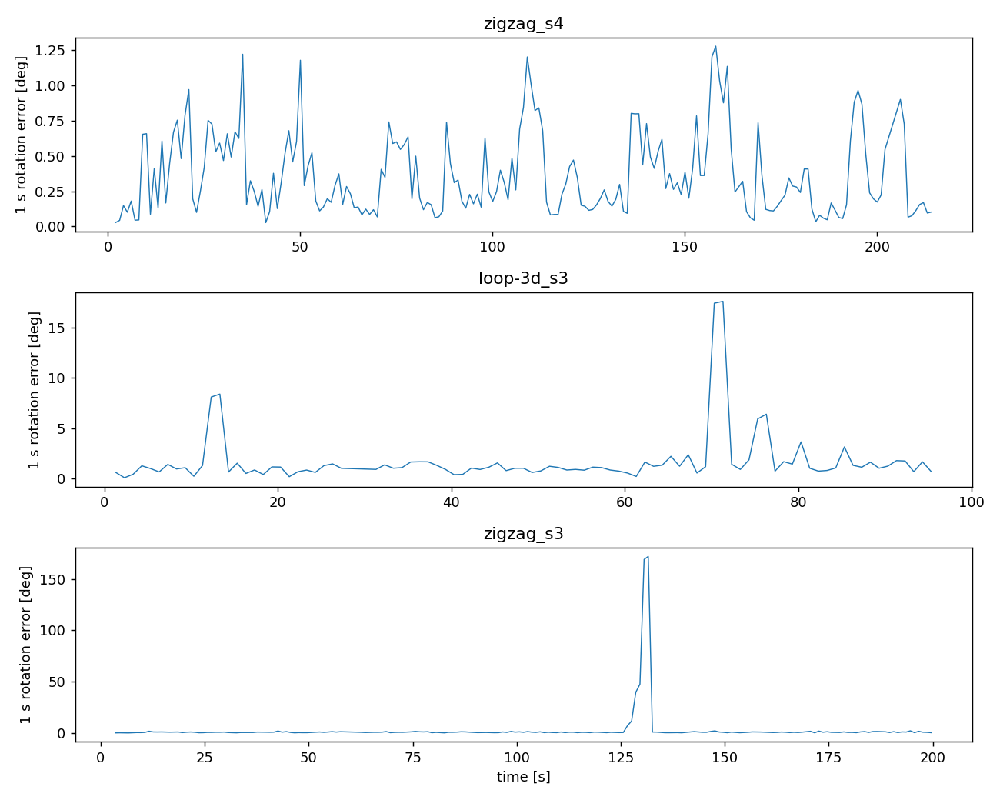

# STAR-loc 六项输入验证

本轮是GT辅助development诊断，独立于CSV附带GT匹配：同步只用UWB文件rig GT姿态与IMU实测gyro，不读取imu.csv附带GT。未把新offset或任何诊断拟合写回估计器。旧RR锁和全部失败保留。
信号同步前半拟合/后半检验，不是从未曝光的held-out。0.1s增量、proper轴候选、单位假设、低运动阈值、局部闭合窗口和裁剪控制均见[协议](STARLOC_SIGNAL_DIAGNOSTIC_PROTOCOL.md)。

三条物理gyro支持在旧offset基础上增加约28–31ms，后半独立最优点也相近；修正改善多数旋转闭合，但不能消除异常区间。它是等效信号延迟，不确定是否来自硬件、滤波或GT处理。

| recording | 旧offset s | 信号offset s | 增加ms | 后半最优s | 后半gyro误差旧 rad/s | 后半gyro误差新 rad/s |
|---|---|---|---|---|---|---|
| zigzag_s4 | 0.177321 | 0.205170 | 27.849231 | 0.210000 | 0.050095 | 0.044199 |
| loop-3d_s3 | 0.789776 | 0.820452 | 30.676745 | 0.820000 | 0.211323 | 0.193828 |
| zigzag_s3 | -1.426310 | -1.396377 | 29.933770 | -1.390000 | 0.839651 | 0.837292 |

分别选择的gyro和acc轴变换三条均为diag(1,-1,-1)，与旧等效变换相同。它是proper旋转，不是整体取负；作者README描述acc在rig系、gyro在IMU系，官方上游处理仍未闭合，不能把等效诊断当精确外参标定。
低运动段旧轴的重力方向中位误差：zigzag_s4前/后2.45°/2.18°；loop前1.97°、后半无合格低运动样本（NA）；zigzag_s3前/后2.69°/1.81°。静态方向只能约束倾斜，不能唯一辨别绕重力轴的旋转。低运动不等于严格静止，仍混有bias、动态加速度和GT/原点误差。
加速度模长约9.8m/s²，不是单位g，且保留重力；角速度直接rad/s明显比乘π/180更一致。后半单位对照如下（所有可用窗口，含异常，不只运动子集）：

| recording | 假设 | gyro误差RMSE rad/s | 中位数 | P95 |
|---|---|---|---|---|
| zigzag_s4 | rad/s | 0.030394 | 0.011479 | 0.057174 |
| zigzag_s4 | deg/s_to_rad/s | 0.180862 | 0.049808 | 0.415580 |
| zigzag_s4 | rad/s_misread_x180/pi | 10.275747 | 2.690825 | 23.633942 |
| loop-3d_s3 | rad/s | 0.195776 | 0.029269 | 0.165968 |
| loop-3d_s3 | deg/s_to_rad/s | 0.501499 | 0.410538 | 0.740760 |
| loop-3d_s3 | rad/s_misread_x180/pi | 26.411924 | 24.211474 | 39.776729 |
| zigzag_s3 | rad/s | 0.802788 | 0.023379 | 0.182728 |
| zigzag_s3 | deg/s_to_rad/s | 0.855801 | 0.258131 | 0.573354 |
| zigzag_s3 | rad/s_misread_x180/pi | 18.152844 | 15.189378 | 31.323599 |

短时闭合从GT初始姿态、位置、速度开始，bias取零，不拟合bias；这是局部IMU验证，不是导航ATE或可部署估计器。Python中点积分用于分离旋转传播与acc项，另调用当前已链接的C++ ImuPreintegrator/IntegrateBetween/GTSAM Combined原实现复核1486个窗口。原生采用右端采样，和中点法有正常离散差异。

下面为旧offset/旧轴、1秒原生预积分闭合；0.1/0.5秒及全部窗口在CSV中。

| recording | 窗口n | 旋转RMSE ° | 旋转中位 ° | 位置RMSE m | 位置中位 m |
|---|---|---|---|---|---|
| loop-3d_s3 | 92 | 3.272475 | 1.158818 | 0.219222 | 0.181258 |
| zigzag_s3 | 191 | 18.054876 | 0.769600 | 0.316425 | 0.175579 |
| zigzag_s4 | 210 | 0.475698 | 0.274730 | 0.191205 | 0.189819 |

把传播姿态替换成GT姿态，1秒位置RMSE仍约0.191/0.201/0.312m（zigzag_s4/loop/zigzag_s3），与完整积分0.191/0.214/0.316m接近。说明平移残差并非主要由这1秒内gyro积分漂移引起；acc bias/小倾角、时延、原点及GT速度误差仍需区分，不作唯一归因。
zigzag_s3的128–133s中，GT 0.1s姿态增量对应角速率最高18.345rad/s，同期gyro最高0.678rad/s；1秒局部旋转误差可达约172°。quaternion范数正常，SO3角度已消除q/−q表示歧义。loop70–73s也有3.272 vs0.850rad/s不一致。只能确认参考与物理信号矛盾，尚不能认定究竟是GT异常、IMU异常还是上游时间/处理错误。异常窗口未删除。

裁剪共同起止端点（按旧输入时间，不按GT或残差选段）：

| recording | 共同开始s | 共同结束s | 删首UWB | 删尾UWB |
|---|---|---|---|---|
| zigzag_s4 | 0.097314 | 218.136266 | 23 | 0 |
| loop-3d_s3 | 0.005835 | 99.757134 | 1 | 3 |
| zigzag_s3 | 0.100713 | 201.573646 | 0 | 3 |

实际精度对照仅跑此前直接BOOTSTRAP_IMU_EMPTY的zigzag_s4：删除首23条UWB，保留全部IMU，首保留UWB为0.098236299s，所有旧offset/轴/噪声/solver/detector参数不动。重新初始化及step4规划属于裁剪的实际影响，不能把新旧输入当同support RR。
prepare/Cauchy共同身份、ROS全行往返、SF无消息启动通过；producer、Cauchy、SF各一次，每树1800秒。producer不再报BOOTSTRAP_IMU_EMPTY，但在x106线性系统不定，仍未产出Stage2。以下基线在裁剪后共同网格、每方法新旧共同有效时刻重新全区间SE3对齐：

| method | variant | status | ATE RMSE m | 窗口RMSE m | ATE P95 m | 共同覆盖率 |
|---|---|---|---|---|---|---|
| robust_cauchy | uncropped | SUCCESS | 375.928913 | 407.516888 | 725.249452 | 0.992664 |
| robust_cauchy | cropped | SUCCESS | 371.747159 | 406.050331 | 732.529532 | 0.992664 |
| SFUISE-ToA | uncropped | SUCCESS | 0.429326 | 0.572579 | 1.069276 | 0.993581 |
| SFUISE-ToA | cropped | SUCCESS | 0.850512 | 0.969460 | 1.381478 | 0.993581 |

入口并非完全一样：
- STAR-loc RR：run_recover_vs_reject.py负责按列读取raw range/tag1、旧时间offset和轴变换，发布measurement cache v2。
- MILUV RR：run_miluv_recover_vs_reject.py专用白名单读取range_raw/tag10/PX4，不附加时间偏移/转轴，采用作者杆臂，发布同一cache v2 schema。
- 两者在C++ runner的t07_cache分支会合，共用InputPlan/初始化/IE-GTSAM；SFUISE另经CSV→ROS桥，保留原生初始化/优化。相同后端不等于原始列可混用。
- legacy还存在LoadMiluvCsv/LoadSfuiseBag/LoadFromBag等分支。尤其legacy MILUV UWB解析按首列range、末列timestamp的旧布局；本批CSV采用具名timestamp/range_raw列，本轮RR明确绕过该legacy解析，不能从RR成功读取推断所有旧入口都兼容。

3项Python工程测试及1项原生恒定旋转/重力闭合fixture通过。第一版临时native harness未匹配现有库-march=native的Eigen ABI，其结果无效并保留；匹配ABI后才取得上表，未重编译或修改后端。另一个fixture首行整数字段误序列化为浮点，已隔离为无效fixture；正式native输入一直使用正确整数格式。

[全部诊断JSON](evidence/starloc-signal-diagnostic-20260912A/results.json)、[原生预积分](evidence/starloc-signal-diagnostic-20260912A/native_abi_matched/native_summary.json)、[裁剪指标](evidence/starloc-signal-diagnostic-20260912A/crop/crop_metrics.csv)、[裁剪命令和退出码](evidence/starloc-signal-diagnostic-20260912A/crop/execution.json)、[工程记录](evidence/starloc-signal-diagnostic-20260912A/engineering.json)。
完整私有诊断：`/home/mint/ws_fusion_uwb/evaluator_private/icra/starloc_signal_20260912A`；裁剪完整输出：`/home/mint/ws_fusion_uwb/src/uwb-imu-fusion-ie/experiments/results/starloc-crop-diagnostic-20260912A`。不写回诊断参数、不改核心、不升级恢复收益claim、不commit/push。

